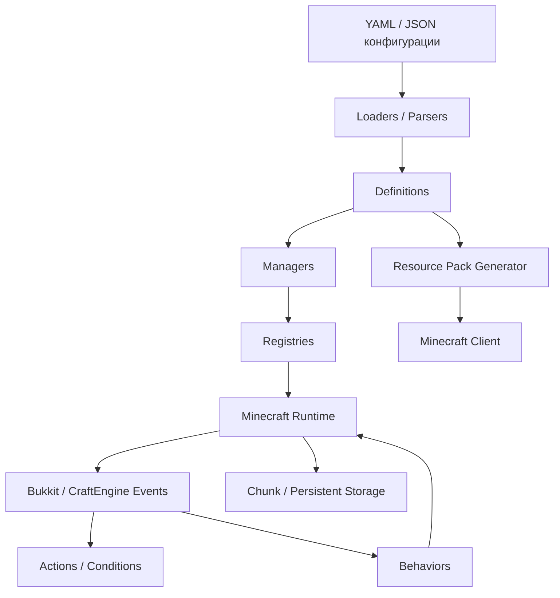
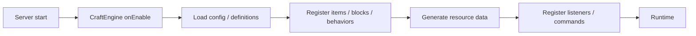
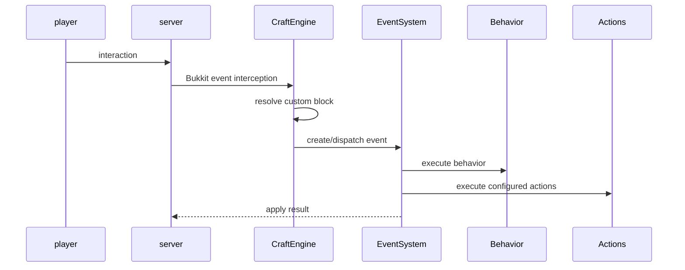

# CraftEngine — Complete Documentation FINAL

> **Назначение:** canonical reference для человека и LLM, создающей и проверяющей конфиги CraftEngine.
> **Актуальная сверка:** 23 августа 2026.
> **Главное правило:** разделы `CANONICAL / 26.8 REFERENCE` имеют приоритет. Историческая часть ниже сохранена только для поиска происхождения старых сведений и **НЕ ДОЛЖНА использоваться как источник синтаксиса при генерации нового конфига**.

## Жёсткий протокол для LLM

1. Сначала определить target Minecraft version и CraftEngine version.
2. Использовать только snake_case-ключи и структуры, подтверждённые canonical reference.
3. Не переносить Java/Kotlin field names напрямую в YAML.
4. Для Block сначала проверить `state/states`, затем required properties каждого `behavior`, затем `settings`, затем `loot/events`.
5. Для Item сначала проверить `material`, затем `data`, `model`, `behavior`, `settings`, `events`; root model fields проверять отдельно.
6. Для Furniture сначала проверить обязательные `variants`, затем `settings`, `behaviors`, `loot`, `events`.
7. При composite behaviors объединить **все required properties** и проверить потенциальные конфликты.
8. Если ключ или параметр найден только в historical/old report и не подтверждён current reference — считать его `UNCONFIRMED`, не генерировать молча.
9. Для resource/model changes использовать `reload all`; для обычного config — `reload config`; для recipes — `reload recipe`.
10. Для API считать стабильным только содержимое `bukkit/.../api`; внутренние packages — unstable/internal.
11. Не придумывать JS API, globals, `on(...)`, `placeholder(...)`, Nashorn/GraalJS и т.п. без прямого подтверждения текущей scripting reference/source.
12. При конфликте источников приоритет: current wiki → current repository → current examples/common-files → release notes → historical reports.

## Канонические источники текущей редакции

- Introduction: https://xiao-momi.github.io/craft-engine-wiki/
- Configuration: https://xiao-momi.github.io/craft-engine-wiki/configuration/
- Item: https://xiao-momi.github.io/craft-engine-wiki/configuration/item/
- Item Data: https://xiao-momi.github.io/craft-engine-wiki/configuration/item/data/
- Item Models: https://xiao-momi.github.io/craft-engine-wiki/configuration/item/models/
- Item Settings: https://xiao-momi.github.io/craft-engine-wiki/configuration/item/settings/
- Block: https://xiao-momi.github.io/craft-engine-wiki/configuration/block/
- Block Behaviors: https://xiao-momi.github.io/craft-engine-wiki/configuration/block/behaviors/
- Furniture: https://xiao-momi.github.io/craft-engine-wiki/configuration/furniture/
- Recipe: https://xiao-momi.github.io/craft-engine-wiki/configuration/recipe/
- Commands: https://xiao-momi.github.io/craft-engine-wiki/reference/commands/
- API: https://xiao-momi.github.io/craft-engine-wiki/api/
- Template: https://xiao-momi.github.io/craft-engine-wiki/reference/template/
- Repository: https://github.com/Xiao-MoMi/craft-engine

---

# ЧАСТЬ I — CANONICAL REFERENCE ДЛЯ CRAFTENGINE 26.8

## 1. Главная модель конфигурации

Актуальная документация строит CraftEngine вокруг нескольких независимых слоёв:

```text
ITEM
├── material
├── data
├── model
├── behavior / behaviors
├── settings
└── events

BLOCK
├── state / states
├── settings
├── behavior / behaviors
├── loot
└── events

FURNITURE
├── variants
├── settings
├── behavior / behaviors
├── loot
└── events
```

Это важнее старой документации, где многие из этих сущностей смешивались в общий `settings`/`components` слой. Официальные страницы Item и Block прямо описывают такую анатомию.

### Главное правило

**Не придумывать структуру из Java field names.** Конфигурационный parser использует именно documented config keys. Например, актуальный ключ — `fuel_time`, а не старое иллюстративное `fuelTime`. ([Item Settings](https://xiao-momi.github.io/craft-engine-wiki/configuration/item/settings/))

---

## 2. Конфигурационные файлы

CraftEngine загружает `.yml` и `.json` файлы внутри `configuration/`, включая вложенные директории, и объединяет их. Форму организации файлов можно выбирать свободно: по типу (`items.yml`, `blocks.yml`), по теме (`weapons.yml`) или смешанно. ([Project Structure](https://xiao-momi.github.io/craft-engine-wiki/getting_start/project_structure/))

Пример:

```yaml
items:
  default:diamond:
    material: diamond

blocks:
  default:my_block:
    state:
      auto_state: note_block
```

### Перезагрузка

| Что изменено | Команда |
|---|---|
| YAML-конфиги | `/ce reload config` |
| Recipes | `/ce reload recipe` |
| Resource/model/texture | `/ce reload all` |
| Всё сразу | `/ce reload all` |

`/ce reload` без аргумента по умолчанию равен `config`. ([Commands](https://xiao-momi.github.io/craft-engine-wiki/reference/commands/); [Project Structure](https://xiao-momi.github.io/craft-engine-wiki/getting_start/project_structure/))

**Типичная ошибка:** поменяли PNG/JSON-модель и вызвали только `reload config`. В этом случае resource pack не обязан пересобираться.

---

## 3. Advanced Configuration Engine

### 3.1. Section Identifier

CraftEngine допускает разнесение нескольких конфигураций одного типа через section identifiers и не требует держать всё в одном YAML-секции. Используйте этот механизм, когда нужно избежать повторного `items:`/`blocks:` и сохранить структурированный merged config.

### 3.2. Recursive directories

Всё ниже `configuration/` с расширением `.yml`/`.json` сканируется рекурсивно.

### 3.3. Version-based config

Поддерживаются selectors:

```yaml
$$1.21.4:
  ...

$$1.20.1~1.21.4:
  ...

$$>=1.21.4:
  ...

$$<1.21.8:
  ...

$$fallback: ...
```

Есть два принципиальных режима: **value selection** и **merge/override**. ([Configuration](https://xiao-momi.github.io/craft-engine-wiki/configuration/))

### 3.4. Expanded YAML scalar types

Для явного типа доступны формы вроде:

```yaml
long_value: !!long 1234
float_value: !!float 12.34
byte_value: !!byte 1
short_value: !!short 123
byte_array_value: !!ByteArray [1,2,3,4]
int_array_value: !!IntArray [1,2,3,4]
long_array_value: !!LongArray [1,2,3,4]
double_array_value: !!DoubleArray [1.1,2.2,3.3]
int_list: !!IntList [1,2,3]
long_list: !!LongList [1,2,3]
double_list: !!DoubleList [1,2,3]
```

### 3.5. Subpacks

Resource packs могут иметь subpacks, выбираемые по версии сервера/клиента через selectors.

---

# CANONICAL / 26.8 REFERENCE — ДОПОЛНЕНИЯ ПО ПОСЛЕДНЕЙ ПРОВЕРКЕ

## A. Configuration Engine

CraftEngine configuration supports YAML and JSON, recursive loading under the configuration directory, section identifiers, version selectors, expanded scalar types and subpacks. Version selectors documented by the current wiki include fixed versions (`$$1.21.4`), ranges (`$$1.20.1~1.21.4`), comparisons (`$$>=1.21.4`, `$$<1.21.8`) and `$$fallback`. Selectors can be used both for value selection and for section merging/overrides.

### A.1. Data-typing syntax

Documented typed values include `!!long`, `!!float`, `!!byte`, `!!short`, `!!ByteArray`, `!!IntArray`, `!!LongArray`, `!!DoubleArray`, `!!IntList`, `!!LongList`, `!!DoubleList`.

### A.2. Subpacks

Subpacks can be selected with version selectors and can bundle alternative resource configurations.

## B. Item — canonical anatomy

```yaml
items:
  namespace:item_id:
    material: paper
    data:
      ...
    model:
      ...
    behavior:
      ...
    settings:
      ...
    events:
      ...
```

### B.1. Item root fields

`custom_model_data`, `item_model`, `hand_animation_on_swap`, `oversized_in_gui`, `swap_animation_scale` are root-level fields, not nested under `settings`. Current item model documentation gives these defaults: `hand_animation_on_swap=true`, `oversized_in_gui=true`, `swap_animation_scale=1.0`.

### B.2. Item Data

`data` is the data-component layer. Current documentation explicitly includes/addresses:

- `item_name`;
- `custom_name`;
- `lore`;
- `insert_lore`;
- `remove_lore`;
- `tooltip_style`;
- `hide_tooltip`;
- `dyed_color`;
- `trim`;
- `custom_model_data`;
- `item_model`;
- `profile`;
- `food`;
- `equippable`;
- `use_remainder`;
- `unbreakable`;
- `max_damage`;
- attribute modifiers / attributes;
- enchantments;
- `block_state`;
- client-bound material/data paths where supported.

**Food:** on 1.20.5+ the `food` data component defines nutrition/saturation, but the item also needs a `consumable` component to actually be edible.

**Equippable:** documented from 1.21.2+ with fields including `slot`, `asset_id`, `camera_overlay`, and other equipment behaviour controls.

**Repeated processors:** append `#<id>` to a data key when the same processor needs to be applied more than once; the suffix is a uniqueness mechanism and is stripped during parsing.

**Client-bound data:** lets the visual/client representation carry rich data separately from the lightweight server-side stack. Use only the currently documented client-bound fields for the target edition/version.

### B.3. Item Settings — canonical names

Current settings documentation uses snake_case names. Confirmed examples include:

| Key | Meaning | Current documented default/notes |
|---|---|---|
| `fuel_time` | furnace fuel duration in ticks | explicit numeric value |
| `break_power` | tool break power | default inherits from vanilla material |
| `tags` | recipe tags | list of tags |
| `equipment` | plugin equipment behaviour | target/version dependent |
| `renameable` | allow anvil rename | default `true` |
| `prevent_break` | do not destroy on durability exhaustion | default `false` |
| `can_place` | allow corresponding vanilla block placement | default `false` |
| `food` | plugin-side food fallback | prefer data components on 1.20.5+ |
| `consume_replacement` | item returned after consume | default `null` |
| `craft_remainder` / `craft_remaining_item` | crafting remainder rules | fixed / hurt_and_break / recipe_based forms documented |
| `fuel_remainder` | returned item after fuel consumption | applies to stack size 1 |
| `invulnerable` | damage sources ignored by item | list of source ids |
| `enchantable` | allow/disallow enchantment table use | default `true` |
| `compost_probability` | probability of composting | default `0.5` |
| `keep_on_death_chance` | probability of keeping item on death | `0..1` |
| `destroy_on_death_chance` | probability of destroying on death | `0..1` |
| `drop_display` | dropped-item name/count display | bool or format string |
| `glow_color` | colored item glow | named color |

**Important:** `fuelTime`, `maxStackSize` and similar camelCase forms from historical reports are not canonical current YAML syntax.

## C. Item Models — 1.21.4+

Minecraft's item model system is a model tree. CraftEngine wraps it in YAML. Branching model types include `condition`, `select`, `range_dispatch` and `composite`; leaves can use concrete model types.

### C.1. Condition model

Documented fields:

| Field | Type | Required |
|---|---|---|
| `type` | string | yes |
| `property` | string | yes |
| `on_true` | model | yes |
| `on_false` | model | yes |
| `transformation` | object | no |

Documented boolean properties include `minecraft:broken`, `minecraft:carried`, `minecraft:damaged`, `minecraft:extended_view`, `minecraft:fishing_rod/cast`, `minecraft:selected`, `minecraft:using_item`, `minecraft:view_entity`, `minecraft:bundle/has_selected_item`, plus `minecraft:component` on newer versions.

### C.2. Model authoring rule

Do not translate a Block model into Item model syntax by analogy. Item model definitions and block appearances are separate systems.

## D. Block — canonical anatomy

```yaml
blocks:
  namespace:block_id:
    state:
      ...
    settings:
      ...
    behavior:
      ...
    loot:
      ...
    events:
      ...
```

`state/states` is the block-state layer; the exact state definition controls carrier state, properties, variants and appearance.

### D.1. Behavior dependency rule

Every behavior page documents the properties it expects, including type and whether the property is required. Examples from the current docs:

- crop-like behaviors require `age` (integer);
- door-like behaviors may require `hinge`;
- button behavior requires `powered`;
- directional output from `face_attached_horizontal_directional_block` additionally depends on `face` and `facing`.

Property names are currently hardcoded for many behaviors; custom property aliases should not be invented unless the target documentation explicitly supports them.

### D.2. Composite behaviors

Use `behaviors:` when multiple behaviors must coexist. Merge all required properties from all participating behaviors and inspect combinations for conflicts.

```yaml
behaviors:
  - type: concrete_powder_block
    solid_block: default:solid_gunpowder_block
  - type: falling_block
```

### D.3. State variant matching

Current state documentation describes variant keys as comma-separated `property=value` pairs. Unlisted properties act as wildcards. Multiple variant entries can match the same state; later matching overrides can replace settings values while preserving other merged values. Order of properties inside the variant key does not affect matching.

Example:

```yaml
variants:
  waterlogged=true:
    settings:
      resistance: 100.0
      fluid_state: water

  facing=up:
    settings:
      resistance: 50.0
      luminance: 15
```

For `waterlogged=true,facing=up`, the final merged resistance is `50.0`, with `fluid_state: water` and `luminance: 15`.

## E. Block Settings — practical current reference

Current Block documentation explicitly groups hardness, sounds, light, burn, mining tools, friction and tags under settings. Also document any version-specific fields such as `required_break_power`, `fluid_state`, shape/occlusion-related settings and destroy-stage settings only when present in the target version.

Do **not** assume that every Java `BlockBehaviour.Properties` field has a CraftEngine YAML key.

## F. Block Item placement

The current docs distinguish ordinary `block_item` placement from specialized variants that share the `block` reference, including:

- Ceiling Block Item;
- Wall Block Item;
- Ground Block Item;
- Double High Block Item;
- Multi High Block Item;
- Liquid Collision Block Item.

This distinction matters when porting mod blocks whose placement rules are not ordinary clicked-face placement.

## G. Furniture — canonical anatomy

```yaml
furniture:
  namespace:furniture_id:
    variants:
      ...
    settings:
      ...
    behaviors:
      ...
    loot:
      ...
    events:
      ...
```

Only `variants` is mandatory. Current docs describe furniture as an entity-based decoration system using display entities, with CraftEngine-specific management.

### G.1. Variants

Variants contain visual `elements`, `hitboxes`, optional seats and transforms. Elements can reference an item model; hitboxes can define interaction/collision characteristics.

### G.2. Settings

Current examples document `item`, `hit_times`, and `sounds.break/place/hit`. `item` is useful for creative middle-click on 1.21.4+.

### G.3. Binding to an Item

`furniture_item` is an Item Behavior that points to furniture by id or embeds the furniture definition inline. Placement rules may specify rotation/alignment; liquid-collision furniture uses a dedicated variant.

## H. Recipes — current high-level contract

The current Recipe documentation distinguishes standard recipe definitions from premium-only Functions and Conditions. Auto-unlock and unlock-on-join are documented. Example global unlock configuration uses:

```yaml
recipe:
  unlock-on-join:
    all: false
    list:
      - default:amethyst_torch
```

For exact recipe type, ingredient schema, processors and premium-only fields, always use the target version's Recipe page rather than the historical examples in the archive.

## I. Commands — current canonical set

Current docs state that most commands use `/craftengine` with `/ce` as alias, while some utility commands are standalone. Command availability/permission/path is controlled by `plugins/CraftEngine/commands.yml`; changes to commands.yml require restart. Many commands support `--silent` / `-s`.

Confirmed current commands include:

```text
/ce reload [all/recipe/config/pack]
/ce upload
/ce clean-cache [custom_model_data/custom_block_states/visual_block_states/font/all]
```

Do not use the old `/ce reload [all]` documentation as a complete command reference; the current command page is authoritative.

## J. API stability

Only classes under the Bukkit `api` package are considered stable. Other internal integration points are explicitly described as unstable, especially during beta. For plugin development, use the documented API package and follow the current convention of listening to Bukkit events and converting blocks/items through `CraftEngineBlocks` instead of depending directly on convenience custom events.

## K. Global Variables

Current docs define reusable text snippets under `global_variables` and reference them using `<global:id>` tags. These are intended for names, lore, messages, GUIs and other text-bearing configuration.

Example:

```yaml
global_variables:
  rare_tag: "<!i><bold><#FF8C00>[RARE]</#FF8C00></bold>"

items:
  default:topaz_sword:
    data:
      item_name: "<global:rare_tag> Topaz Sword"
```

## L. Template System

The template system supports argument substitution and helper argument modes such as `condition` and `when`. `config_factory` can generate multiple related definitions (for example items + recipes + inline furniture) from a blueprint and variants list. The current docs derive `${__NAMESPACE__}` and `${__ID__}` from entry ids for config factories.

## M. Explicit exclusions / unsafe assumptions

The following are **not canonical without direct current-source confirmation**:

- `display-name` as a universal current root item key;
- `fuelTime`;
- `maxStackSize`;
- assumed Java field → YAML key mappings;
- old `events.break: { message: ... }` examples from research reports;
- old `behavior: "myplugin:range_mining_item"` scalar syntax when the current behavior reference expects a mapping;
- any universal JS `on(...)`, `placeholder(...)`, `console.log`, `ScriptEngine`, Nashorn, GraalJS globals unless directly confirmed by current scripting docs/source;
- Minecraft `1.26.x` compatibility claims;
- claiming every internal package is stable API.

---

# CANONICAL SOURCE COVERAGE MATRIX

| Domain | Current source | Status |
|---|---|---|
| Configuration engine | `/configuration/` | canonical |
| Items | `/configuration/item/` | canonical |
| Item Data | `/configuration/item/data/` | canonical |
| Item Models | `/configuration/item/models/` | canonical |
| Item Settings | `/configuration/item/settings/` | canonical |
| Item Behaviors | `/configuration/item/behaviors/` | canonical |
| Item Updater | `/configuration/item/updater/` | canonical |
| Blocks | `/configuration/block/` | canonical |
| Block States | `/configuration/block/states/` | canonical |
| Block Properties | `/configuration/block/properties/` | canonical |
| Block Settings | `/configuration/block/settings/` | canonical |
| Block Behaviors | `/configuration/block/behaviors/` | canonical |
| Furniture | `/configuration/furniture/` | canonical |
| Recipes | `/configuration/recipe/` | canonical |
| Global Variables | `/configuration/global_variable/` | canonical |
| Events | `/reference/events/` | canonical |
| Commands | `/reference/commands/` | canonical |
| Templates | `/reference/template/` | canonical |
| API | `/api/` | canonical, stable API caveat |

## Coverage rule

If a requested field belongs to one of the domains above but is not explicitly reproduced in this document, the model should **navigate to the corresponding current source page** rather than infer the field. This is intentionally safer than inventing a key.

---

# 4. ITEM — АКТУАЛЬНАЯ КАНОНИЧЕСКАЯ СХЕМА

Официальная Item Reference задаёт структуру примерно так:

```yaml
items:
  namespace:item_id:
    material: ...

    data:
      ...

    model:
      ...

    behavior:
      ...

    settings:
      ...

    events:
      ...
```

Также есть root-level model-related поля: `custom_model_data`, `item_model`, `hand_animation_on_swap`, `oversized_in_gui`, `swap_animation_scale`. ([Item](https://xiao-momi.github.io/craft-engine-wiki/configuration/item/))

---

## 5. ITEM DATA — DATA COMPONENT LAYER

`data` задаёт данные ItemStack. Большая часть ключей отражает vanilla data components, а CraftEngine выполняет cross-version conversion. ([Item Data](https://xiao-momi.github.io/craft-engine-wiki/configuration/item/data/))

### 5.1. Повторное применение processor

Один и тот же processor можно применить несколько раз, добавляя к ключу `#<id>`:

```yaml
data:
  insert_lore#1:
    position: TAIL
    lore:
      - "First"

  insert_lore#2:
    position: HEAD
    lore:
      - "Second"
```

`#id` используется для уникальности YAML-ключа и удаляется при parsing. Этот подход применим не только к lore, но и к `attribute_modifiers#...`, `lore#...` и другим data keys.

### 5.2. Канонические data keys

| Key | Назначение |
|---|---|
| `item_name` | default item name |
| `custom_name` | player/custom override name |
| `lore` | описание |
| `tooltip_style` | tooltip background |
| `hide_tooltip` | скрытие отдельных component groups |
| `dyed_color` | цвет dyeable item |
| `trim` | armor trim |
| `custom_model_data` | data component value |
| `item_model` | item_model component value |
| `profile` | player-head profile/texture |
| `food` | food data |
| `equippable` | equipment component |
| `use_remainder` | remainder после использования |
| `unbreakable` | unbreakable component |
| `max_damage` | durability cap |
| `attribute_modifiers` / `attributes` | attribute modifiers |
| `enchantment` | enchantments |
| `painting_variant` | painting variant |
| `jukebox_playable` | jukebox song |
| `block_state` / `blockstate` | block state при placement |
| `pdc` | persistent custom data |
| `tags` / `nbt` | low-level NBT |
| `written_book_content` | written book |
| `random_values` | persisted random values |
| `external` | external plugin item source |
| `components` | raw custom data components |
| `remove_components` | remove components |
| `client_bound_data` | per-client display data (Premium) |
```

([Item Data](https://xiao-momi.github.io/craft-engine-wiki/configuration/item/data/))

### 5.3. `item_name` vs `custom_name`

`item_name` — базовое имя; не стирается Anvil, по умолчанию не italic.

`custom_name` — пользовательское/custom имя с более высоким приоритетом отображения и типичным italic behavior.

### 5.4. `custom_model_data`: ВАЖНО

Есть две разные семантики:

```yaml
data:
  custom_model_data: 10001
```

и:

```yaml
custom_model_data: 10001
```

Первый вариант задаёт component value, но **не привязывает модель сам по себе**. Root-level вариант используется CraftEngine для model generation/binding. Аналогично `item_model` внутри `data` и root-level `item_model` — это не одно и то же по смыслу генерации моделей. ([Item Data](https://xiao-momi.github.io/craft-engine-wiki/configuration/item/data/))

### 5.5. Food

```yaml
data:
  food:
    nutrition: 5
    saturation: 3.5
    can_always_eat: false
```

Наличие `food` само по себе не означает, что item можно есть: документированное правило требует также `consumable` component.

### 5.6. Equippable

```yaml
data:
  equippable:
    slot: head
    asset_id: minecraft:topaz
    swappable: true
    damage_on_hurt: true
    dispensable: false
    equip_on_interact: true
```

Поддерживаемые documented slots: `head`, `chest`, `legs`, `feet`, `body`, `mainhand`, `offhand`, `saddle`. `equip_on_interact` документирован с 1.21.5+.

### 5.7. `use_remainder`

Позволяет заменить используемый item после уменьшения stack count:

```yaml
data:
  use_remainder:
    id: default:chicken_bone
    count: 1
```

### 5.8. `attribute_modifiers`

```yaml
data:
  attribute_modifiers:
    - type: attack_speed
      amount: 1.0
      operation: add_value
      id: namespace:custom_attribute
      slot: mainhand
```

Alias: `attributes`.

### 5.9. `enchantment`

Простой вариант:

```yaml
data:
  enchantment:
    minecraft:sharpness: 3
```

Для merge existing enchantments используется map form с `merge: true`.

### 5.10. `block_state`

Используется для placement state и ускоряет отображение для high-latency игроков.

```yaml
data:
  block_state:
    note: "1"
    powered: "false"
    instrument: "harp"
```

Либо shorthand к custom block state:

```yaml
data:
  block_state: default:palm_sapling[stage=0]
```

Материал item должен визуально соответствовать host block state.

### 5.11. `pdc`, `tags`, `nbt`

`pdc` предназначен для persistent key/value данных, которые читают другие plugins:

```yaml
data:
  pdc:
    key: "value"
    number: 42
    list: [1, 2]
```

`tags` / `nbt` дают low-level NBT access; `@` может использоваться для flatten nested paths.

### 5.12. `components`

Raw custom components поддерживаются, но CraftEngine не управляет их совместимостью с будущими версиями Minecraft. Поэтому это более низкоуровневый/fragile слой.

Присутствие component без данных:

```yaml
data:
  components:
    minecraft:unbreakable: {}
```

---

# 6. ITEM MODEL SYSTEM — 1.21.4+

Minecraft 1.21.4+ использует item model definitions. CraftEngine представляет их YAML-деревом. У узлов есть `type`; branching node содержит child models. ([Item Models](https://xiao-momi.github.io/craft-engine-wiki/configuration/item/models/))

### 6.1. Базовый static model

```yaml
model:
  type: minecraft:model
  path: tutorial:item/sword
```

Допустим shorthand:

```yaml
model: tutorial:item/sword
```

### 6.2. Model node types

| Type | Назначение |
|---|---|
| `minecraft:model` | один статичный model |
| `minecraft:composite` | несколько моделей-слоёв |
| `minecraft:condition` | 2 ветки по bool property |
| `minecraft:select` | выбор по discrete/enum property |
| `minecraft:range_dispatch` | выбор по числовым threshold |
| `minecraft:special` | vanilla special renderer |
| `minecraft:empty` | ничего не рендерить |
| `minecraft:bundle/selected_item` | selected item внутри bundle |

### 6.3. Composite

```yaml
model:
  type: minecraft:composite
  models:
    - type: minecraft:model
      path: tutorial:item/base
    - type: minecraft:model
      path: tutorial:item/glow
```

### 6.4. Condition

```yaml
model:
  type: minecraft:condition
  property: minecraft:using_item
  on_true:
    type: minecraft:model
    path: tutorial:item/charged
  on_false:
    type: minecraft:model
    path: tutorial:item/idle
```

Documented properties include `minecraft:broken`, `carried`, `damaged`, `extended_view`, `fishing_rod/cast`, `selected`, `using_item`, `view_entity`, `bundle/has_selected_item`, plus newer component-oriented properties such as `minecraft:component`, `minecraft:has_component`, `minecraft:keybind_down`, `minecraft:custom_model_data`. ([Condition](https://xiao-momi.github.io/craft-engine-wiki/configuration/item/models/condition/))

### 6.5. Select

`select` выбирает модель по discrete value. Fields: `type`, `property`, `cases`, optional `fallback`, optional `transformation`. ([Select](https://xiao-momi.github.io/craft-engine-wiki/configuration/item/models/select/))

Пример:

```yaml
model:
  type: minecraft:select
  property: minecraft:charge_type
  cases:
    - when: arrow
      model:
        type: minecraft:model
        path: tutorial:item/arrow
    - when: rocket
      model:
        type: minecraft:model
        path: tutorial:item/rocket
  fallback:
    type: minecraft:model
    path: tutorial:item/standby
```

### 6.6. Range Dispatch

Выбирается **последний entry, чей `threshold <= value`**, иначе используется `fallback`, либо empty.

```yaml
model:
  type: minecraft:range_dispatch
  property: minecraft:damage
  scale: 1.0
  entries:
    - threshold: 0.0
      model:
        type: minecraft:model
        path: tutorial:item/full
    - threshold: 0.5
      model:
        type: minecraft:model
        path: tutorial:item/damaged
  fallback:
    type: minecraft:model
    path: tutorial:item/full
```

### 6.7. Transformations

С 26.1+ documented `transformation` поддерживается на model types, кроме `empty` и `bundle/selected_item`. Разложенная форма применяется в порядке:

```text
right_rotation → scale → left_rotation → translation
```

### 6.8. Root model fields

```yaml
hand_animation_on_swap: true
oversized_in_gui: true
swap_animation_scale: 1.0
```

Также root-level `custom_model_data` и `item_model` имеют специальное значение для model generation. ([Item Models](https://xiao-momi.github.io/craft-engine-wiki/configuration/item/models/))

---

# 7. ITEM BEHAVIORS

Актуальный список, подтверждённый navigation дерева wiki:

- `block_item`
- `ceiling_block_item`
- `compostable_item`
- `double_high_block_item`
- `furniture_item`
- `ground_block_item`
- `liquid_collision_block_item`
- `liquid_collision_furniture_item`
- `multi_high_block_item`
- `range_mining_item`
- `wall_block_item`

([Item Behaviors](https://xiao-momi.github.io/craft-engine-wiki/configuration/item/behaviors/))

### Главное правило

Behavior у item указывается через `behavior` либо `behaviors`. Несколько behavior можно комбинировать.

```yaml
behaviors:
  - type: range_mining_item
    conditions: []
    range:
      - 0,1,0
      - 0,-1,0

  - type: block_item
    block: default:topaz_ore
```

([Item Behaviors](https://xiao-momi.github.io/craft-engine-wiki/configuration/item/behaviors/))

### `block_item`

Это canonical механизм связи item → placeable block.

```yaml
behavior:
  type: block_item
  block: default:my_block
```

`block` также может содержать inline block configuration.

Специализированные placement variants используют тот же `block`: ceiling, wall, ground, double high, multi high, liquid collision. ([Block](https://xiao-momi.github.io/craft-engine-wiki/configuration/block/))

---

# 8. ITEM SETTINGS

В отличие от `data`, `settings` — plugin-driven mechanisms. Это важнейшее разделение. ([Item Settings](https://xiao-momi.github.io/craft-engine-wiki/configuration/item/settings/))

Подтверждённый current key `fuel_time`:

```yaml
settings:
  fuel_time: 100
```

`break_power` задаёт break power инструмента. Vanilla values документированы как:

```text
wood/gold = 1
stone/copper = 2
iron = 3
diamond = 4
netherite = 5
other = 0
```

Также documented `tags`, используемые в recipes.

**Важно:** старые формы `fuelTime`, `maxStackSize` и подобные camelCase из предыдущих отчётов НЕ использовать как canonical config syntax, если текущая wiki не показывает обратное.

---

# 9. BLOCK — АКТУАЛЬНАЯ КАНОНИЧЕСКАЯ СХЕМА

Каждый custom block — один ID внутри `blocks:`. Обязателен только `state` или `states`; `settings`, `behavior`, `loot`, `events` опциональны. ([Block](https://xiao-momi.github.io/craft-engine-wiki/configuration/block/))

```yaml
blocks:
  namespace:block_id:
    state:
      ...
    settings:
      ...
    behavior:
      ...
    loot:
      ...
    events:
      ...
```

### Связь Block → Item

На block side:

```yaml
settings:
  item: namespace:block_item
```

Это служит для block→item lookup/creative middle-click. Сам placement делает item-side `block_item` behavior.

---

# 10. BLOCK STATES — КЛЮЧЕВАЯ МЕХАНИКА

Есть два режима:

```text
state  = один внутренний state
states = множество внутренних states
```

### 10.1. Single state

```yaml
state:
  auto_state: note_block
  model:
    path: minecraft:block/custom/my_block
```

### 10.2. `auto_state`

Официально документированы группы, среди которых:

```text
solid
note_block
mushroom_stem
red_mushroom_block
brown_mushroom_block
mushroom
tintable_leaves
waterlogged_tintable_leaves
non_tintable_leaves
waterlogged_non_tintable_leaves
leaves
waterlogged_leaves
lower_tripwire
higher_tripwire
tripwire
sapling
pressure_plate
cactus
sugar_cane
weeping_vine
twisting_vine
cave_vine
kelp
chorus
```

Смысл `auto_state` — автоматически выбрать свободный vanilla carrier state из совместимой группы. ([Block States](https://xiao-momi.github.io/craft-engine-wiki/configuration/block/states/))

### 10.3. Shared auto-state

Если нужно разделить один carrier state между несколькими appearances:

```yaml
auto_state:
  type: solid
  id: my_shared_id
```

Одинаковый `id` означает совместное использование carrier state.

---

# 11. MULTI-STATE BLOCKS

```yaml
states:
  properties:
    ...

  appearances:
    ...

  variants:
    ...
```

### 11.1. Properties

Property определяет внутренние состояния. CraftEngine создаёт все комбинации возможных значений.

Пример:

```yaml
properties:
  waterlogged:
    type: boolean
    default: false

  distance:
    type: int
    default: 7
    range: 1~7

  facing:
    type: horizontal_direction
    default: north
```

Количество states = произведение количества значений каждого property.

Пример:

```text
waterlogged (2) × distance (7) = 14 states
```

Documented counts include:

```text
boolean                = 2
int(min,max)            = max-min+1
axis                    = 3
direction               = 6
horizontal_direction   = 4
half / hinge            = 2
slab_type               = 3
stairs_shape             = 5
```

### 11.2. Special property names

Некоторые имена зарезервированы/имеют hardcoded placement behavior:

| Property | Special behavior |
|---|---|
| `axis` | автоматическое выравнивание оси |
| `facing` | автоматическое направление placement |
| `facing_clockwise` | горизонтальное направление с вращением |
| `rotation` | точная rotation (`0~7` или `0~15`) |
| `waterlogged` | water state |

Переименование, например, в `custom_axis` убирает automatic placement behavior. ([Block States](https://xiao-momi.github.io/craft-engine-wiki/configuration/block/states/))

### 11.3. Internal block IDs

Можно вручную задавать `id` для state/state range:

```yaml
state:
  id: 0
  auto_state: note_block
```

или:

```yaml
states:
  id: 100
  properties: ...
```

Для N states будет занят непрерывный диапазон. ID должен быть глобально уникальным и не выходить за предел `serverside-blocks` из `config.yml`.

---

# 12. APPEARANCES + VARIANTS

`appearances` описывают visual states, `variants` отображают внутренние states на appearances. ([Block States](https://xiao-momi.github.io/craft-engine-wiki/configuration/block/states/))

Пример:

```yaml
states:
  properties:
    facing:
      type: horizontal_direction
      default: north

  appearances:
    north:
      auto_state:
        type: sugar_cane
        id: transparent
      transparent: true
      entity_renderer:
        type: item_display
        item: default:sign_post
        rotation: 0

    east:
      auto_state:
        type: sugar_cane
        id: transparent
      transparent: true
      entity_renderer:
        type: item_display
        item: default:sign_post
        rotation: 90

  variants:
    facing=north:
      appearance: north
    facing=east:
      appearance: east
```

### Variant matching

```text
waterlogged=false
```
ограничивает только `waterlogged`; все остальные properties не ограничиваются.

Много properties разделяются запятыми:

```yaml
facing=north,waterlogged=false:
  appearance: default
```

При overlap:

- appearance выбирается согласно first-match semantics;
- `settings` matching variants merge, позже добавленное значение перекрывает раннее при совпадении ключа;
- если appearance не найден, используется **первая appearance** как default fallback.

---

# 13. BLOCK MODEL SIMPLIFICATION

Для model/texture configuration CraftEngine умеет выводить модель из количества текстур. Документированные правила упрощённой генерации включают:

| Число textures | Предполагаемый model |
|---:|---|
| 1 | `cube_all` |
| 2 | `cube_column` |
| 3 | `cube_bottom_top` |
| 4 | `orientable` |
| 5+ | `block/cube` style generation |

Для одной texture `path` может выводиться автоматически; для нескольких texture path нужен явно в documented simplified form.

Для сложных axisX/axisZ случаев следует использовать explicit `model` + `generation`, а не полагаться на simplifier.

---

# 14. BLOCK SETTINGS — АКТУАЛЬНЫЙ СПИСОК

Официальная текущая страница разделяет Stable и Unstable settings.([Block Settings](https://xiao-momi.github.io/craft-engine-wiki/configuration/block/settings/))

## Stable

| Key | Смысл | Default |
|---|---|---:|
| `hardness` | время разрушения | 2.0 |
| `resistance` | взрывоустойчивость | 2.0 |
| `push_reaction` | piston behavior | NORMAL |
| `map_color` | map color | 0 |
| `burnable` | можно зажечь | false |
| `fire_spread_chance` | fire spreading | 0 |
| `burn_chance` | ignite chance | 0 |
| `item` | связанные block item ID | null |
| `replaceable` | replaceable block | false |
| `is_redstone_conductor` | redstone conductor | UNDEFINED |
| `is_suffocating` | suffocation | UNDEFINED |
| `is_view_blocking` | view blocking | UNDEFINED |
| `sounds` | sound set | null |
| `require_correct_tools` | correct tool required for drop | false |
| `respect_tool_component` | respect `minecraft:tool.correct_for_drops` | false |
| `correct_tools` | whitelist correct tools | null |
| `incorrect_tool_dig_speed` | speed multiplier for wrong tool | 0.3 |
| `tags` | block tags | null |
| `client_bound_tags` | client-side vanilla block tags | null |
| `instrument` | note block instrument | harp |
| `fluid_state` | fluid state | empty |
| `support_shape` | support shape source block | visual state's support shape |
| `destroy_stages` | custom mining-crack display | null |

### Sounds

`fall`, `hit`, `break`, `step`, `place` можно задавать строкой или map form с `id`, `pitch`, `volume`. Ranged volume поддерживается.

### Tools

```yaml
require_correct_tools: true
correct_tools:
  - minecraft:wooden_pickaxe
  - minecraft:stone_pickaxe
```

Если указан `correct_tools`, `require_correct_tools` становится logically active. `incorrect_tool_dig_speed` documented range: `0~1`.

### Tags

```yaml
tags:
  - minecraft:mineable/axe
  - minecraft:logs
  - minecraft:logs_that_burn
```

### Destroy stages

Можно заменить vanilla crack display на custom items и настроить offset/position/scale/rotation/display transform/billboard/view range/brightness.

Пример:

```yaml
destroy_stages:
  items:
    - minecraft:destroy_stage_0
    - minecraft:destroy_stage_1
  translation: 0,0.5,0
  scale: 1,1,1
  rotation: 0
  billboard: fixed
  view_range: 1.0
  brightness:
    block_light: 15
    sky_light: 15
```

## Unstable

Следующие settings прямо документированы как unstable / имеющие caveats:

```text
bounce_restitution
friction
jump_factor
speed_factor
luminance
can_occlude
block_light
propagate_skylight
```

Свет особенно важен: документация предупреждает, что server-side control light system ограничен и client-side skylight occlusion полностью исправить пакетами нельзя.

---

# 15. BLOCK BEHAVIORS — АКТУАЛЬНАЯ СИСТЕМА

Behavior подключается через `behavior` либо список `behaviors`. Каждая behavior-страница документирует свойства, которых она ожидает. Property names пока во многих случаях hardcoded. ([Block Behaviors](https://xiao-momi.github.io/craft-engine-wiki/configuration/block/behaviors/))

Пример:

```yaml
behavior:
  type: bush_block
  bottom_block_tags:
    - minecraft:dirt
    - minecraft:farmland
```

### Composite

```yaml
behaviors:
  - type: concrete_powder_block
    solid_block: default:solid_gunpowder_block

  - type: falling_block
```

Критическое правило: при composite нужно объединить **все required properties** всех behaviors; некоторые behaviors конфликтуют и могут работать непредсказуемо.

### Пример dependency

`button_block` требует:

```text
powered : boolean — yes
face    : anchor_type — required при directed output
facing  : horizontal_direction — required при directed output
```

При этом `face`/`facing` приходят от `face_attached_horizontal_directional_block`, а не от самого button behavior. ([Button Block](https://xiao-momi.github.io/craft-engine-wiki/configuration/block/behaviors/button_block/))

---

# 16. EVENTS — АКТУАЛЬНЫЙ DSL

`events` — это не просто map `trigger -> arbitrary action`. Каноническая современная форма использует **event entries**, `functions` и optional `conditions`. ([Events](https://xiao-momi.github.io/craft-engine-wiki/reference/events/))

```yaml
events:
  - on: right_click
    functions:
      - type: command
        command: say hello
        conditions:
          - type: permission
            permission: craftengine.admin
```

Можно объединять несколько triggers:

```yaml
events:
  - on:
      - attack
      - left_click
    functions:
      - type: command
        command: say attacked
```

### Trigger catalog

#### Items

```text
break
right_click
left_click
consume
pick_up
attack
```

#### Blocks

```text
break
place
right_click
left_click
step
```

#### Furniture

```text
break
place
right_click
```

**Важно:** event должен лежать в config domain объекта, который реально получает interaction. Например, furniture event должен быть внутри furniture config, а не произвольно внутри item, который его размещает.

---

# 17. EVENTS — FUNCTIONS REFERENCE

Подтверждённые official functions включают следующий набор.

### Flow

- `cancel_event` — отменить исходное событие.
- `run` — выполнить последовательность functions; поддерживает `delay`.
- `if_else` — первая rule, чьи conditions выполняются.
- `when` — switch-like selection по source.

### Messaging

- `message` — chat или overlay.
- `actionbar` — actionbar.
- `title` — title/subtitle с fade_in/stay/fade_out.

### World/block

- `break_block`
- `place_block`
- `update_block_property`
- `transform_block`
- `drop_loot`
- `update_interaction_tick`
- `cycle_block_property`

### Items/player

- `set_count`
- `damage_item`
- `potion_effect`
- `remove_potion_effect`
- `set_cooldown`
- `remove_cooldown`
- `set_exp`
- `set_level`
- `play_totem_animation`

### Audio/effects/integration

- `play_sound`
- `particle`/particle-related functions (см. official Particle Effect reference)
- `cast_mythic_skill`
- `teleport`

### Furniture/entity/UI

- `spawn_furniture`
- `remove_furniture`
- `replace_furniture`
- `rotate_furniture`
- `remove_entity`
- `open_window`
- `merchant_trade`

([Events](https://xiao-momi.github.io/craft-engine-wiki/reference/events/))

### 17.1. `cancel_event`

```yaml
- type: cancel_event
```

### 17.2. `run`

```yaml
- type: run
  delay: 0
  functions:
    - type: message
      message: One
    - type: message
      message: Two
```

### 17.3. `command`

```yaml
- type: command
  command: "say hello <arg:player.name>"
  target: self
  as_player: false
  as_op: false
  as_event: false
```

`as_op` explicitly documented as a potential security risk; safer approach is console execution where appropriate.

### 17.4. `message`

```yaml
- type: message
  message: "Hello <papi:player_name>"
  target: self
  overlay: false
```

### 17.5. `actionbar`

```yaml
- type: actionbar
  actionbar: "Hello"
  target: self
```

### 17.6. `title`

```yaml
- type: title
  title: "<red>Title</red>"
  subtitle: "<yellow>Subtitle</yellow>"
  fade_in: 20
  stay: 10
  fade_out: 10
```

### 17.7. `open_window`

Documented `gui_type` enum includes:

```text
anvil
enchantment
grindstone
loom
smithing
crafting
cartography
```

### 17.8. `break_block`

Defaults к context position. Можно переопределить `x/y/z`.

### 17.9. `place_block`

```yaml
- type: place_block
  block_state: default:chinese_lantern
  x: <arg:block.block_x>
  y: <arg:block.block_y>
  z: <arg:block.block_z>
```

### 17.10. `update_block_property`

```yaml
- type: update_block_property
  properties:
    axis: x
    age: 7
```

### 17.11. `transform_block`

Меняет текущий block на другой, сохраняя подходящие properties, с optional overrides:

```yaml
- type: transform_block
  block: default:palm_log
  properties:
    property_a: b
```

### 17.12. `drop_loot`

```yaml
- type: drop_loot
  to_inventory: false
  loot:
    pools: ...
```

### 17.13. `set_count`

```yaml
- type: set_count
  add: true
  count: -1
  target: self
```

### 17.14. `potion_effect`

```yaml
- type: potion_effect
  potion_effect: minecraft:blindness
  duration: 20
  amplifier: 0
  ambient: false
  particles: true
  show_icon: true
```

### 17.15. `set_cooldown` / `remove_cooldown`

```yaml
- type: set_cooldown
  time: 1m30s
  id: my_cooldown_id
  add: false

- type: remove_cooldown
  id: my_cooldown_id
```

### 17.16. `play_sound`

```yaml
- type: play_sound
  sound: minecraft:block.note_block.bell
  target: self
  pitch: 1
  volume: 1
  source: master
```

### 17.17. Furniture functions

`spawn_furniture`, `remove_furniture`, `replace_furniture`, `rotate_furniture` имеют собственные coordinate/variant/drop/sound parameters; `rotate_furniture` имеет `on_success`/`on_failure`.

---

# 18. CONDITIONS И CONTEXT

Event functions обычно поддерживают `conditions`, например:

```yaml
conditions:
  - type: permission
    permission: craftengine.admin
```

Для сложной логики используйте `if_else`/`when`, а не пытайтесь «встроить JavaScript» в обычный YAML без соответствующей documented scripting feature.

`when`:

```yaml
- type: when
  source: <papi:player_world>
  cases:
    - when: world
      functions:
        - type: message
          message: Overworld
  fallback:
    - type: message
      message: Other
```

---

# 19. RECIPE SYSTEM

Официальная Recipe Reference включает обычные recipe types, predicates, unlock logic и premium functions/conditions.

### Predicate

Recipe ingredient может проверять не только ID/tag, но и дополнительные item data/enchantments:

```yaml
recipes:
  default:sharpness_upgrade:
    type: shapeless_transform
    ingredients:
      - items: minecraft:diamond_sword
        source: true
      - items: minecraft:paper
        predicate:
          - type: enchantment
            enchantments:
              minecraft:sharpness: 5
    result:
      id: default:topaz_sword
      count: 1
```

### Unlock

Documented:

```yaml
unlock_on_ingredient_obtained: true
unlock_on_join: true
```

Global config также может управлять unlock-on-join. ([Recipe](https://xiao-momi.github.io/craft-engine-wiki/configuration/recipe/))

---

# 20. LOOT

`loot` — отдельный слой block/furniture drops. `drop_loot` function может принудительно выполнить loot table. Поскольку подробная canonical schema зависит от соответствующего Loot Table reference, нельзя использовать старые псевдопримеры как исчерпывающий DSL без проверки страницы Loot Table.

---

# 21. FURNITURE

Текущая wiki рассматривает furniture как отдельный top-level content type. Минимально mandatory section — `variants`; через него задаются appearance и spatial occupation. Дополнительные layers: `settings`, behaviors, loot, events. ([Furniture](https://xiao-momi.github.io/craft-engine-wiki/configuration/furniture/))

Это означает, что furniture нельзя считать просто «блоком с entity». При генерации конфигов нужно выбирать именно furniture schema.

---

# 22. RESOURCE PACK / FILE CONFLICT

CraftEngine имеет собственную систему resolution при конфликте ресурсов. Подтверждённые matching rules:

```text
all_of
any_of
inverted
filename
exact
parent_path_prefix
parent_path_suffix
contains
pattern
```

Resolution types:

```text
merge_json
retain_matching
conditional
merge_pack_mcmeta
merge_atlas
merge_font
```

Это особенно важно при интеграции чужих resource packs. ([File Conflict](https://xiao-momi.github.io/craft-engine-wiki/reference/file_conflict/))

---

# 23. WORLDGEN И DATAPACK COMPATIBILITY

CraftEngine позволяет использовать custom block IDs в worldgen/datapack-like configuration. Documented custom state providers включают:

```text
craftengine:simple_state_provider
craftengine:weighted_state_provider
craftengine:rotated_block_provider
craftengine:randomized_int_state_provider
```

Также существует `craftengine:simple_block` для configured features, включая проблемы с multi-state/double-height placement. ([Worldgen Feature](https://xiao-momi.github.io/craft-engine-wiki/configuration/worldgen_feature/); [Datapack Compatibility](https://xiao-momi.github.io/craft-engine-wiki/compatibility/datapack/))

---

# 24. COMMANDS — АКТУАЛЬНАЯ REFERENCE

Основной namespace команд — `/craftengine`, alias `/ce`. Точная enabled state, permission node и command path задаются в `plugins/CraftEngine/commands.yml`; изменения требуют restart. Большинство команд поддерживает `--silent` / `-s`. ([Commands](https://xiao-momi.github.io/craft-engine-wiki/reference/commands/))

### Reload

```text
/ce reload [all/recipe/config/pack]
```

### Resource management

```text
/ce upload
/ce resource list
/ce resource enable [pack]
/ce resource disable [pack]
/ce resource create [pack] (namespace) (author) (description)
/ce resource save-default [path]
/ce resource search [type] [resource]
```

### Cache

```text
/ce clean-cache [type]
```

Documented cache types:

```text
custom_model_data
custom_block_states
visual_block_states
font
all
```

### Debug commands

Актуальная reference включает, среди прочего:

```text
/ce debug is-section-injected
/ce debug setblock [location] [block-state]
/ce debug spawn-furniture [location] [furniture-id] (variant)
/ce debug clear-cooldown [player]
/ce debug is-chunk-persistent-loaded
/ce debug entity-id [world] [entityId]
/ce debug custom-model-data (item-id)
/ce debug item-model (item-id)
/ce debug image [image-id] (row) (column)
/ce debug furniture
/ce debug optimize-furniture-structure [world] [file] (y-offset)
```

Также documentation current Data Reference использует debug-команду `item-component` для копирования компонента с существующего предмета.

---

# 25. API — АКТУАЛЬНОЕ ПРАВИЛО СТАБИЛЬНОСТИ

Официальная API page прямо говорит:

> только содержимое package `bukkit/.../api` считается stable; остальные внутренние точки интеграции могут меняться, особенно во время beta.

Recommended integration dependency:

```yaml
dependencies:
  server:
    CraftEngine:
      load: BEFORE
      required: false
      join-classpath: true
```

Рекомендуемый путь для block events — **не цепляться напрямую к CustomBlockBreakEvent**, а слушать соответствующий Bukkit event, получить BlockData и преобразовать его через `CraftEngineBlocks`. ([API](https://xiao-momi.github.io/craft-engine-wiki/api/))

Для регистрации behaviors/host types рекомендуется сначала искать соответствующие registry constant classes, например `BlockBehaviors` и `ItemBehaviors`, и использовать их `register` methods.

---

# 26. JAVASCRIPT / SCRIPTING — КАК УЧИТЫВАТЬ В LLM

В старой сводке было противоречие относительно встроенного JS runtime. В актуальной структуре official wiki есть отдельная `Reference → Scripting` страница, поэтому теперь правильная политика такая:

1. **Не использовать старые гипотетические `on(...)`, `placeholder(...)`, `ScriptEngine`, Nashorn/GraalJS globals без прямой проверки текущей Scripting reference.**
2. Конфигурационный event DSL (`events` + `functions` + `conditions`) — canonical и подтверждён официальной wiki.
3. Любой JS API должен считаться version-specific, пока его точные globals/signatures не подтверждены текущей `reference/scripting` страницей и/или исходным кодом текущего commit.
4. LLM не должна превращать «в исходниках существует ScriptFile» автоматически в публичный user-facing JS API.

**Именно это исправляет главный недостаток старых исследовательских файлов.**

---

# 27. TEMPLATE SYSTEM

CraftEngine имеет template system. Среди documented value transformers есть как минимум:

```text
condition
when
```

### `condition`

Превращает условие в один из двух параметров:

```yaml
arguments:
  leaves_base_model:
    type: condition
    condition: "${tintable:-false}"
    on_true: leaves
    on_false: cube_all
```

### `when`

Map source → result:

```yaml
arguments:
  slot:
    type: when
    source: "${part}"
    when:
      helmet: head
      chest: chest
      leggings: legs
      boots: feet
    fallback: any
```

([Template System](https://xiao-momi.github.io/craft-engine-wiki/reference/template/))

---

# 28. CATEGORY / GUI CONTENT

Текущая wiki также документирует `category`. Параметры включают:

| Key | Default | Смысл |
|---|---|---|
| `name` | category ID | display name, MiniMessage |
| `lore` | empty | lore icon |
| `icon` | minecraft:stone | item icon |
| `priority` | 0 | order |
| `hidden` | false | hidden main-menu category |
| `conditions` | none | visibility conditions |
| `list` | empty | ordered items/subcategories |
| `all_items` | false | include all custom items |

([Category](https://xiao-momi.github.io/craft-engine-wiki/configuration/category/))

---

# 29. OTHER CURRENT CONTENT TYPES

По navigation текущей official configuration доступны отдельные разделы:

```text
Item
Block
Furniture
Category
Emoji
Equipment
Font
Image
Translations
Recipe
Sound
Jukebox Song
Loot Source
Worldgen Feature
Global Variables
Painting
```

Не следует сворачивать все эти сущности в старую модель «только items/blocks/furniture». Это реальные configuration domains текущей документации.

---

# 30. AI CONFIG GENERATION PROTOCOL

Этот раздел специально предназначен для LLM.

## 30.1. Алгоритм генерации

Перед выдачей YAML модель должна пройти:

```text
1. Определить CraftEngine version.
2. Определить Minecraft version.
3. Определить content type: item / block / furniture / recipe / ...
4. Выбрать canonical top-level schema.
5. Проверить required sections.
6. Проверить property types.
7. Проверить behavior dependencies.
8. Проверить model version compatibility.
9. Проверить item-side placement behavior, если блок должен ставиться.
10. Проверить loot.
11. Проверить events/functions/conditions.
12. Проверить namespace и IDs.
13. Выдать YAML.
14. Самопроверка: нет ли несуществующих ключей, смешения old/new syntax и missing dependencies.
```

## 30.2. Hard rules

### Rule A — не смешивать Java names и YAML names

Нельзя автоматически превращать:

```text
fuelTime -> fuel_time
maxStackSize -> max_stack_size
````

если это не подтверждено reference.

### Rule B — behavior ≠ property

Behavior может требовать properties. Сначала строятся `states.properties`, затем behavior.

### Rule C — state ≠ model

`state/auto_state` выбирает **carrier/internal visual state**, а `model` определяет resource/model appearance.

### Rule D — block placement

Для placeable custom block обычно нужны **две связи**:

```text
Block.settings.item  ← block ↔ item mapping
Item.behavior.block_item ← actual placement behavior
```

### Rule E — events

Современный canonical form — `events` + `on` + `functions` + optional `conditions`.

### Rule F — version-aware models

Если model system зависит от 1.21.4+, не генерировать старую CMD/override-only schema без проверки target version.

### Rule G — disputed API

Если API/behavior/property не найден в current official reference — маркировать `NOT CONFIRMED`, а не придумывать его.

---

# 31. REFERENCE RECORD FORMAT ДЛЯ LLM

Каждый config key в knowledge base желательно хранить как:

```text
NAME: settings.fuel_time
TYPE: integer
REQUIRED: false
DEFAULT: documented/default if available
VERSION: current reference / version-specific
SCOPE: item
DESCRIPTION: ...
ALLOWED: ...
DEPENDENCIES: ...
CONFLICTS: ...
EXAMPLE: ...
SOURCE: https://...
STATUS: STABLE | PREMIUM | UNSTABLE | LEGACY | NOT_CONFIRMED
```

Для behavior:

```text
NAME: bush_block
TYPE: block behavior
REQUIRED_PROPERTIES: ...
OPTIONAL_PROPERTIES: ...
PARAMETERS: ...
COMPOSABLE: yes/no
CONFLICTS: ...
SOURCE: ...
```

Для model node:

```text
TYPE: minecraft:condition
REQUIRED: property,on_true,on_false
OPTIONAL: transformation
PROPERTY_FAMILY: boolean
MIN_VERSION: 1.21.4 / as documented
SOURCE: ...
```

---

# 32. VALIDATION CHECKLIST

Перед тем как считать конфиг «готовым»: \n
- [ ] ID имеет `namespace:path`.
- [ ] YAML structure соответствует текущему content type.
- [ ] Для block есть `state` или `states`.
- [ ] Для multi-state все required properties определены.
- [ ] Property type соответствует ожидаемому behavior.
- [ ] Composite behaviors не конфликтуют.
- [ ] Item placer имеет подходящий behavior.
- [ ] `settings.item` при необходимости указывает правильный item ID.
- [ ] Model syntax соответствует target Minecraft.
- [ ] Root `custom_model_data`/`item_model` не перепутаны с `data.*`.
- [ ] Food имеет необходимую consumable component.
- [ ] Events лежат в правильном content domain.
- [ ] Functions используют current syntax.
- [ ] Recipe изменён через `reload recipe`.
- [ ] Resource pack changes применены через `reload all`.
- [ ] Нет неподтверждённых Java-only field names в YAML.

---

# 33. ОФИЦИАЛЬНЫЕ ИСТОЧНИКИ

- GitHub: https://github.com/Xiao-MoMi/craft-engine
- Wiki: https://xiao-momi.github.io/craft-engine-wiki/
- Configuration: https://xiao-momi.github.io/craft-engine-wiki/configuration/
- Item: https://xiao-momi.github.io/craft-engine-wiki/configuration/item/
- Item Data: https://xiao-momi.github.io/craft-engine-wiki/configuration/item/data/
- Item Models: https://xiao-momi.github.io/craft-engine-wiki/configuration/item/models/
- Item Behaviors: https://xiao-momi.github.io/craft-engine-wiki/configuration/item/behaviors/
- Item Settings: https://xiao-momi.github.io/craft-engine-wiki/configuration/item/settings/
- Block: https://xiao-momi.github.io/craft-engine-wiki/configuration/block/
- Block Settings: https://xiao-momi.github.io/craft-engine-wiki/configuration/block/settings/
- Block States: https://xiao-momi.github.io/craft-engine-wiki/configuration/block/states/
- Block Behaviors: https://xiao-momi.github.io/craft-engine-wiki/configuration/block/behaviors/
- Events: https://xiao-momi.github.io/craft-engine-wiki/reference/events/
- Commands: https://xiao-momi.github.io/craft-engine-wiki/reference/commands/
- API: https://xiao-momi.github.io/craft-engine-wiki/api/
- Template: https://xiao-momi.github.io/craft-engine-wiki/reference/template/
- File Conflict: https://xiao-momi.github.io/craft-engine-wiki/reference/file_conflict/
- Recipe: https://xiao-momi.github.io/craft-engine-wiki/configuration/recipe/
- Furniture: https://xiao-momi.github.io/craft-engine-wiki/configuration/furniture/
- Worldgen Feature: https://xiao-momi.github.io/craft-engine-wiki/configuration/worldgen_feature/
- Datapack Compatibility: https://xiao-momi.github.io/craft-engine-wiki/compatibility/datapack/

---

# ЧАСТЬ II — ИСТОРИЧЕСКАЯ СВОДКА И ПРЕДЫДУЩИЙ АНАЛИЗ

Следующий раздел сохранён из v2 без потери материала. Он полезен как историческая карта API/исходников, но **не имеет приоритета над Part I**.

# CraftEngine — Полная техническая документация и AI Reference v2

> **Редакция:** расширенная и нормализованная версия предыдущей сводной документации.
>
> **Актуальность проверки:** 23 августа 2026.
>
> **Базовая версия репозитория:** текущий GitHub release `26.8`, commit `c9a2ab6` (release 20 августа 2026). Старое упоминание `26.8.1` из предыдущих отчётов не используется как актуальная версия этого reference. [GitHub Releases](https://github.com/Xiao-MoMi/craft-engine/releases)
>
> **Главные источники:** официальный репозиторий, официальная wiki CraftEngine и предоставленная ранее сводная документация. При конфликте приоритет: текущий исходный код/официальный reference → официальная wiki → release notes → старые исследовательские отчёты.
>
> **Цель:** этот файл предназначен не только для чтения человеком, но и как reference-контекст для LLM, которая должна генерировать корректные CraftEngine-конфиги.

---

## 0. Правила использования этой документации как AI reference

### 0.1. Критическое правило: не выдумывать YAML

Нейросеть должна считать ключ/поле допустимым только тогда, когда оно подтверждено текущей официальной wiki, текущим примером или исходным кодом соответствующей версии.

Нельзя автоматически превращать Java field в YAML key. Например, старые отчёты содержали `fuelTime` и `maxStackSize`, тогда как актуальная wiki использует `fuel_time` и другие snake_case-ключи. Аналогично старые примеры с `display-name` не должны автоматически смешиваться с современной структурой `data.item_name`.

### 0.2. Приоритет источников

1. Текущий commit/release исходников.
2. Текущий `common-files` и реальные example/configuration-файлы.
3. Официальная wiki `xiao-momi.github.io/craft-engine-wiki`.
4. Release notes.
5. Старые исследовательские отчёты.
6. Модельные догадки — **запрещены**, если их нельзя вывести из источника.

### 0.3. Уровни достоверности

| Маркер | Значение |
|---|---|
| **VERIFIED** | подтверждено актуальной официальной документацией/кодом |
| **SOURCE-INFERRED** | напрямую следует из исходного кода, но не обязательно вынесено в user-facing docs |
| **LEGACY** | встречалось в старом отчёте/старой версии; не использовать без проверки |
| **UNCONFIRMED** | обнаружено, но текущий синтаксис не подтверждён |
| **PREMIUM** | функция официально обозначена как Premium-only |

### 0.4. Правило генератора

Перед выдачей YAML нейросеть должна сначала определить:

- версию Minecraft;
- версию CraftEngine;
- тип контента (`item`, `block`, `furniture`, `recipe`, etc.);
- необходимую секцию (`data`, `model`, `behavior`, `settings`, `events`, `loot`);
- зависимости полей (например, `food` требует `consumable` для нормальной еды на 1.20.5+);
- требуемый block state/property;
- нужен ли resource-pack rebuild.

---

## 1. Текущее состояние CraftEngine

CraftEngine — серверный фреймворк для кастомных блоков, предметов, furniture и рецептов без клиентских модов. Контент описывается конфигурацией, движок регистрирует его на сервере, генерирует ресурс-пак и отдаёт ресурсы клиенту. Официальная документация отдельно подчёркивает server-side подход, реальные блоки и интеграцию с datapack/worldgen. [Introduction](https://xiao-momi.github.io/craft-engine-wiki/) [Block](https://xiao-momi.github.io/craft-engine-wiki/configuration/block/)

### 1.1. Текущий релиз

- `26.8` — latest release на момент проверки.
- Commit: `c9a2ab6`.
- Дата release: 20 августа 2026.
- Community Edition доступна из GitHub release.
- Ветка `26.7`, `26.5`, старые `0.0.x` — исторические версии.

Источник: [GitHub Releases](https://github.com/Xiao-MoMi/craft-engine/releases)

### 1.2. Важная коррекция старого документа

В предыдущей документации фигурировало `26.8.1` как текущая версия и даже `1.26.x` как Minecraft-совместимость. Это нельзя использовать как актуальный reference: текущий GitHub показывает `26.8` как latest, а официальная getting-started wiki формулирует prerequisite как Paper-based Minecraft 1.20+. Все версии Minecraft нужно сверять с конкретной release compatibility-матрицей и текущим сервером.

---

# 2. Каноническая модель конфигурации

## 2.1. Общая структура

Современная wiki описывает content entries как записи под корневыми секциями `items:`, `blocks:`, `furniture:`, `recipes:` и т. д. Конфиги лежат внутри package configuration directory, допускают YAML и JSON, а подкаталоги обрабатываются рекурсивно. [Configuration](https://xiao-momi.github.io/craft-engine-wiki/configuration/) [Project Structure](https://xiao-momi.github.io/craft-engine-wiki/getting_start/project_structure/)

```yaml
items:
  namespace:item_id:
    ...

blocks:
  namespace:block_id:
    ...
```

### 2.2. Рекурсивная структура файлов

Официальная wiki разрешает:

```text
configuration/
├── items.yml
├── blocks.yml
├── furniture.yml
├── weapons/
│   ├── swords.yml
│   └── bows.yml
└── blocks/
    ├── natural.yml
    └── machines.yml
```

Все `.yml` и `.json` внутри configuration tree загружаются рекурсивно. [Project Structure](https://xiao-momi.github.io/craft-engine-wiki/getting_start/project_structure/)

### 2.3. Section Identifier

Современная configuration documentation содержит специальный механизм Section Identifier для ситуаций, где повтор одного YAML section name в одном документе неудобен. Это позволяет разбить много конфигураций одного типа внутри одного файла без конфликтующих повторных корней.

### 2.4. Version-Based Configs

CraftEngine поддерживает версионные selectors:

```yaml
$$1.21.4: ...
$$1.20.1~1.21.4: ...
$$>=1.21.4: ...
$$<1.21.8: ...
$$fallback: ...
```

Они применяются как value selectors и для version-specific overrides/merging. Это особенно важно для resource pack content.

---

# 3. ITEM — полная актуальная схема

Официальная Item reference делит предмет на независимые слои: `material`, `data`, `model`, `behavior`, `settings`, `events`, `item updater`, плюс root fields для model system. [Item](https://xiao-momi.github.io/craft-engine-wiki/configuration/item/)

## 3.1. Канонический skeleton

```yaml
items:
  namespace:item_id:
    material: paper

    data:
      ...

    model:
      ...

    behavior:
      ...

    settings:
      ...

    events:
      ...
```

Root-level model compatibility fields:

```yaml
custom_model_data: 10001
item_model: namespace:item_id
hand_animation_on_swap: true
overdized_in_gui: true
swap_animation_scale: 1.0
```

> `overdized_in_gui` выше намеренно не следует копировать: каноническое написание — **`oversized_in_gui`**.

## 3.2. `material`

- Optional.
- По официальной wiki default material configurable in `config.yml` и по умолчанию описывается как `nether_brick`.
- Для vanilla item IDs отдельное поведение material имеет ограничения: documentation говорит, что material игнорируется для vanilla IDs, а остальная конфигурация добавляется поверх них.

Пример:

```yaml
items:
  demo:ruby:
    material: paper
```

## 3.3. `data`

`data` устанавливает data components на ItemStack. Большинство keys соответствуют vanilla data components, а CraftEngine занимается cross-version conversion. [Item Data](https://xiao-momi.github.io/craft-engine-wiki/configuration/item/data/)

### 3.3.1. Множественное применение processor

Любой data key можно повторить, добавив уникальный suffix `#<id>`:

```yaml
data:
  insert_lore#1:
    position: TAIL
    lore:
      - "First"
  insert_lore#2:
    position: HEAD
    lore:
      - "Second"
```

Suffix удаляется при parsing и служит только для уникальности ключа.

### 3.3.2. Appearance data

#### `item_name`

- Базовое отображаемое имя.
- Alias: `display_name`.
- Отличается от `custom_name`.
- По документации не стирается наковальней и не имеет обычного italic behavior custom name.

```yaml
data:
  item_name: "<!i><#FF8C00>Ruby Sword"
```

#### `custom_name`

Игровое/custom имя предмета; имеет более высокий display priority и стандартное поведение имени, заданного игроком.

```yaml
data:
  custom_name: "<!i><gold>Named Sword"
```

#### `lore`

Простейшая форма:

```yaml
lore:
  - "Line 1"
  - "Line 2"
```

Расширенная форма поддерживает priority, operation, split_lines и conditions:

```yaml
lore:
  - content: "Priority 2"
    priority: 2
    operation: APPEND
  - content: "Priority 1"
    priority: 1
    conditions:
      - type: permission
        permission: craftengine.admin
```

Чем меньше priority, тем выше строка. Default operation — `APPEND`.

#### `insert_lore`

Позволяет вставлять строки в существующий lore:

```yaml
insert_lore:
  position: AFTER
  pattern: "Match this"
  lore:
    - content: "Inserted"
  fallback:
    position: TAIL
    lore:
      - content: "Fallback"
```

Позиции: `HEAD`, `TAIL`, `BEFORE`, `AFTER`. `pattern` трактуется как regex для `BEFORE`/`AFTER`.

#### `remove_lore`

Удаляет строки, соответствующие regex.

```yaml
remove_lore: "Remove this line"
```

#### `tooltip_style`

1.21.2+; background texture tooltip.

```yaml
tooltip_style: minecraft:topaz
```

#### `hide_tooltip`

Скрывает tooltip-компоненты:

```yaml
hide_tooltip:
  - dyed_color
  - enchantments
  - attribute_modifiers
```

#### `dyed_color`

```yaml
dyed_color: 255,128,64
```

#### `trim`

```yaml
trim:
  pattern: eye
  material: iron
```

### 3.3.3. Model-data fields внутри `data`

**Критически:**

`data.custom_model_data` и root-level `custom_model_data` — не одно и то же по поведению.

```yaml
data:
  custom_model_data: 10001
```

только задаёт component value.

```yaml
custom_model_data: 10001
```

на root item level участвует в model binding.

То же относится к `item_model`.

### 3.3.4. `profile`

Player-head texture.

Поддерживаются строковые значения, автоматически распознаваемые как:

- player name;
- texture URL;
- base64.

Map form (1.20.5+):

```yaml
profile:
  name: XiaoMoMi
  texture: minecraft:entity/player/slim/alex
  url: https://...
  base64: eyJ0ZXh0dXJlcyI6...
```

Не требуется заполнять все поля одновременно.

### 3.3.5. Food

Для modern component path, 1.20.5+:

```yaml
data:
  food:
    nutrition: 5
    saturation: 3.5
    can_always_eat: false
```

**Важно:** official docs прямо говорят, что предмет также должен иметь `consumable` component, чтобы быть edible. Это принципиально для генератора YAML.

### 3.3.6. `equippable` (1.21.2+)

```yaml
data:
  equippable:
    slot: head
    asset_id: minecraft:topaz
    camera_overlay: namespace:id
    swappable: true
    damage_on_hurt: true
    dispensable: false
    equip_on_interact: true
```

Поддерживаемые slots: `head`, `chest`, `legs`, `feet`, `body`, `mainhand`, `offhand`, `saddle`.

`equip_on_interact` — 1.21.5+.

### 3.3.7. `use_remainder` (1.21.2+)

```yaml
data:
  use_remainder:
    id: default:chicken_bone
    count: 1
```

### 3.3.8. `unbreakable`

```yaml
data:
  unbreakable: true
```

### 3.3.9. `max_damage` (1.20.5+)

```yaml
data:
  max_damage: 100
```

### 3.3.10. `attribute_modifiers`

Alias: `attributes`.

```yaml
attribute_modifiers:
  - type: attack_damage
    amount: 7
    operation: add_value
    id: namespace:custom_attribute
    slot: mainhand
```

### 3.3.11. `enchantment`

```yaml
enchantment:
  minecraft:sharpness: 3
```

Merge mode:

```yaml
enchantment:
  merge: true
  enchantments:
    minecraft:sharpness: 3
```

### 3.3.12. `painting_variant`

```yaml
painting_variant: default:painting_custom
```

### 3.3.13. `jukebox_playable` (1.21+)

```yaml
jukebox_playable: default:credits_music
```

### 3.3.14. `block_state`

Alias `blockstate`.

Используется при размещении block-like item и улучшает responsiveness на latency-sensitive placement.

```yaml
data:
  block_state:
    note: "1"
    powered: "false"
    instrument: "harp"
```

или shorthand для custom block:

```yaml
data:
  block_state: default:palm_sapling[stage=0]
```

**Критический caveat:** material должен визуально соответствовать block state; wiki рекомендует для block items использовать `note_block`/`mushroom_stem`, а не `paper`, если это нужно для корректного клиента.

### 3.3.15. Custom Components

Premium-independent? Нет: documentation описывает `components` как user-provided components, но предупреждает, что они не поддерживаются/не version-checked CraftEngine и могут ломаться при обновлениях Minecraft.

```yaml
data:
  components:
    minecraft:max_damage: 128
```

```yaml
data:
  components:
    minecraft:food:
      nutrition: 4
      saturation: 2.0
      can_always_eat: false
```

Component can be presence-only:

```yaml
components:
  minecraft:unbreakable: {}
```

Удаление:

```yaml
data:
  remove_components:
    - minecraft:equippable
```

### 3.3.16. External Data

```yaml
data:
  external:
    plugin: neigeitems
    id: example_item
```

Поддерживаемые внешние источники зависят от compatibility/external item sources.

### 3.3.17. `client_bound_data` — Premium

Позволяет отделить server-side item data от per-client visual data.

```yaml
client_bound_data:
  conditional#unlocked:
    conditions:
      - type: permission
        permission: item.mythic_sword.unlock
    data:
      item_name: "<!i><gold>Mythic Sword"
      lore:
        - "<green>Unlocked"
        - "<gray>Level <arg:player.level>"
```

`client_bound_data` может включать keys вроде `item_name`, `lore`, `custom_model_data`, `item_model`, `components` и др.

### 3.3.18. `client_bound_material` — Premium

Позволяет менять client-side material, оставляя server-side material прежним.

```yaml
material: nether_brick
client_bound_material: mushroom_stem
client_bound_data:
  block_state: default:palm_planks
```

---

# 4. ITEM MODELS — актуальная модельная система

С версии 1.21.4 Minecraft использует item model definitions. CraftEngine предоставляет YAML-обёртку над model tree. [Item Models](https://xiao-momi.github.io/craft-engine-wiki/configuration/item/models/)

## 4.1. Root fields

| Key | Type | Default | Значение |
|---|---|---:|---|
| `hand_animation_on_swap` | bool | `true` | swap animation |
| `oversized_in_gui` | bool | `true` | разрешает model выходить за границы GUI slot |
| `swap_animation_scale` | float | `1.0` | multiplier скорости swap animation |
| `custom_model_data` | int | auto | legacy/modern model binding |
| `item_model` | namespaced id | auto | прямой model path для 1.21.2+ |

Пример:

```yaml
hand_animation_on_swap: false
oversized_in_gui: true
swap_animation_scale: 1.5
model:
  type: minecraft:model
  path: minecraft:item/custom/sword
```

### 4.2. Automatic CMD / item_model generation

По официальной wiki:

- `custom_model_data` может auto-allocate;
- starting default: `10000`;
- per-material overrides поддерживаются через config;
- `item_model` может auto-generate from item ID на новых pack/client versions;
- `always-use-item-model` default `true`;
- `always-use-custom-model-data` default `false`;
- `always-generate-model-overrides` default `false`;
- `item.client-bound-model` default `true` для Premium-related client-side behavior.

### 4.3. Model types

Подтверждены official docs:

- `minecraft:model` — static model;
- `minecraft:composite` — несколько моделей слоями;
- `minecraft:condition` — branch по boolean;
- `minecraft:select` — branch по enum/string-like property;
- `minecraft:range_dispatch` — numeric threshold dispatch;
- special rendering;
- empty;
- bundle selected item.

### 4.4. Transformation (26.1+)

Decomposed:

```yaml
transformation:
  right_rotation: 0,0,0,1
  scale: 1,1,1
  left_rotation: 0,0,0,1
  translation: 0,0,0
```

Порядок: `right_rotation → scale → left_rotation → translation`.

Quaternion: `[x,y,z,w]`.

Rotation может использовать axis-angle:

```yaml
right_rotation:
  angle: 0.0
  axis: 0,1,0
```

Matrix form — 16 floats row-major.

### 4.5. Simplified model system

CraftEngine может сгенерировать модели по:

1. `texture`;
2. `textures`;
3. `model` / `models`;
4. `models + textures` aligned slot-for-slot;
5. experimental `blueprint` (`.bbmodel`).

Например:

```yaml
material: fishing_rod
textures:
  - minecraft:item/custom/rod
  - minecraft:item/custom/rod_cast
```

или:

```yaml
models:
  - minecraft:item/custom/shield_3d
  - minecraft:item/custom/shield_3d_blocking
```

### 4.6. Legacy model

`legacy_model` предназначен для pre-1.21.4 compatibility и считается не рекомендуемым, если автоматической конверсии хватает.

---

# 5. ITEM SETTINGS — полный verified reference

`settings` отвечает за plugin-driven mechanics, а не за vanilla data components. [Item Settings](https://xiao-momi.github.io/craft-engine-wiki/configuration/item/settings/)

| Key | Назначение |
|---|---|
| `fuel_time` | ticks burning as fuel |
| `break_power` | tool break power |
| `tags` | recipe tags |
| `equipment` | equipment resource mapping |
| `repairable` | repair permissions/config |
| `anvil_repair_item` | durability supplied by repair material |
| `drag_repair_item` | cursor-drag repair behavior |
| `renameable` | allow anvil rename |
| `prevent_break` | keep broken item at last durability |
| `can_place` | allow corresponding vanilla placement |
| `food` | legacy/plugin food implementation |
| `consume_replacement` | returned item after consume |
| `craft_remainder` / `craft_remaining_item` | recipe remainder behavior |
| `fuel_remainder` | remainder after furnace fuel |
| `invulnerable` | damage causes ignored by item entity |
| `enchantable` | enchantment-table eligibility |
| `compost_probability` | chance of successful composting |
| `keep_on_death_chance` | probability item remains on death |
| `destroy_on_death_chance` | probability item gets destroyed on death |
| `drop_display` | dropped item entity name display |
| `glow_color` | custom glow color |
| `dyeable` | dyeing compatibility |
| `dye_color` | color contribution to dye recipe |
| `firework_color` | firework star fade contribution |
| `ingredient_substitute` | vanilla ingredient substitutions |
| `respect_repairable_component` | respect repairable component in anvil |
| `hat_height` | CustomNameplates integration |
| `equipment_set_part` | equipment set membership |
| `projectile` | custom projectile behavior |

## 5.1. `fuel_time`

```yaml
settings:
  fuel_time: 100
```

## 5.2. `break_power`

```yaml
settings:
  break_power: 3
```

Official default behavior: inherit from vanilla material unless overridden. Vanilla break powers documented by wiki: wood/gold 1, stone/copper 2, iron 3, diamond 4, netherite 5, other 0.

## 5.3. `tags`

```yaml
tags:
  - default:palm_logs
  - minecraft:logs
  - minecraft:logs_that_burn
```

## 5.4. `equipment`

```yaml
equipment:
  asset_id: default:topaz
  client_bound_model: true
  slot: head
  camera_overlay: namespace:id
  dispensable: true
  damage_on_hurt: true
  swappable: true
  equip_on_interact: true
```

## 5.5. `repairable`

Simple:

```yaml
repairable: true
```

Detailed:

```yaml
repairable:
  crafting_table: true
  anvil_repair: false
  anvil_combine: true
  grindstone_repair: true
```

## 5.6. Repair item mechanics

```yaml
anvil_repair_item:
  - target: "#topaz_tools"
    amount: 20
  - target:
      - minecraft:iron_pickaxe
      - minecraft:shears
    percent: 0.25
```

`drag_repair_item` работает через cursor drag и может сочетать `amount`, `percent`, `sound`.

## 5.7. `prevent_break`

```yaml
prevent_break: true
```

Сохраняет последний durability point; item становится unusable до ремонта.

## 5.8. `can_place`

Useful для block-like material, если item не должен ставиться как vanilla block.

```yaml
can_place: false
```

## 5.9. `consume_replacement`

```yaml
consume_replacement: minecraft:glass_bottle
```

## 5.10. `craft_remainder`

Fixed item:

```yaml
craft_remainder: bucket
```

Structured:

```yaml
craft_remainder:
  type: fixed
  item: bucket
  count: 1
```

Damage-based:

```yaml
craft_remainder:
  type: hurt_and_break
  damage: 1
```

Recipe-based:

```yaml
craft_remainder:
  type: recipe_based
  terms:
    - recipes:
        - test:test1
        - test:test3
      craft_remainder:
        type: hurt_and_break
    - recipes:
        - test:test2
      craft_remainder: minecraft:stone
```

## 5.11. `fuel_remainder`

Работает для item stack size 1.

## 5.12. `invulnerable`

Пример списка:

```yaml
invulnerable:
  - lava
  - fire
  - fire_tick
  - block_explosion
  - entity_explosion
  - lightning
  - contact
```

## 5.13. `enchantable`

Default `true`; это разрешение для enchantment table, а не способ превратить изначально unenchantable item в enchantable.

## 5.14. `compost_probability`

Default `0.5`.

## 5.15. Death chances

```yaml
keep_on_death_chance: 0.2
destroy_on_death_chance: 0.5
```

Документация указывает диапазон `0..1`.

## 5.16. `drop_display`

```yaml
drop_display: false
```

или:

```yaml
drop_display: true
```

или кастомный формат:

```yaml
drop_display: "<arg:count>x <name>"
```

## 5.17. `glow_color`

Поддерживаются цвета:

`black`, `dark_blue`, `dark_green`, `dark_aqua`, `dark_red`, `dark_purple`, `gold`, `gray`, `dark_gray`, `blue`, `green`, `aqua`, `red`, `light_purple`, `yellow`, `white`.

## 5.18. `dye_color` / `firework_color`

```yaml
dye_color: 255,140,0
firework_color: 255,140,0
```

## 5.19. `ingredient_substitute`

```yaml
ingredient_substitute:
  - minecraft:leather
  - minecraft:paper
```

---

# 6. BLOCK — актуальная каноническая структура

Официальная block reference прямо говорит: минимально обязательна `state`/`states`, всё остальное добавляется слоями. [Block](https://xiao-momi.github.io/craft-engine-wiki/configuration/block/)

```yaml
blocks:
  namespace:block_id:
    state:
      ...
    settings:
      ...
    behavior:
      ...
    loot:
      ...
    events:
      ...
```

## 6.1. Минимальный block

```yaml
blocks:
  default:my_block:
    state:
      auto_state: note_block
      model:
        texture: minecraft:block/custom/my_block
```

## 6.2. Block settings

Из официальной текущей документации подтверждаются, среди прочего:

- `hardness`;
- `resistance`;
- `sounds`;
- `tags`;
- `block_light`/luminance-like settings в зависимости от exact version syntax;
- burn behavior;
- required tools / break power related functionality;
- `friction`;
- `jump_factor`;
- `speed_factor`;
- map/display and physical properties в зависимости от release.

Предыдущий документ содержал более широкий список (`can_occlude`, `is_redstone_conductor`, `is_suffocating`, `is_view_blocking`, `push_reaction`, etc.). Эти поля сохраняются в historical source map, но **для AI генерации следует брать точный snake_case key из текущего Block Settings reference/code, а не автоматически использовать старые camelCase Java names**.

## 6.3. Sounds

Официальный пример допускает map:

```yaml
sounds:
  break: minecraft:block.stone.break
  step: minecraft:block.stone.step
  place: minecraft:block.stone.place
  hit: minecraft:block.stone.hit
  fall: minecraft:block.stone.fall
```

## 6.4. Tags

```yaml
tags:
  - minecraft:mineable/pickaxe
  - minecraft:logs
```

## 6.5. `settings.item`

```yaml
settings:
  item: default:my_block
```

Используется для block→item mapping, в том числе creative middle-click/lookup.

## 6.6. Block item binding

**Block и Item — независимы.** Реальная установка блока от item делается через `block_item` behavior:

```yaml
items:
  default:my_block:
    behavior:
      type: block_item
      block: default:my_block
```

`block` может быть как ID, так и inline block definition:

```yaml
behavior:
  type: block_item
  block:
    state:
      ...
    settings:
      ...
    loot:
      ...
```

## 6.7. Placement variants

Официальная wiki перечисляет варианты:

- Block Item;
- Ceiling Block Item;
- Wall Block Item;
- Ground Block Item;
- Double High Block Item;
- Multi High Block Item;
- Liquid Collision Block Item.

Это важное исправление старого документа: `block_item` — не единственный способ placement behavior.

---

# 7. BLOCK STATES / PROPERTIES

Block behavior может требовать конкретные properties. Официальная behavior reference приводит пример `facing` типа `direction` и `waterlogged` типа `boolean`; crop требует `age`, door требует `hinge`. [Block Behaviors](https://xiao-momi.github.io/craft-engine-wiki/configuration/block/behaviors/)

## 7.1. Главный принцип

Если behavior требует property, property обязано существовать у block state.

Пример концепции:

```yaml
state:
  properties:
    age: 0~7
```

Точный синтаксис каждого property type нужно брать из актуальной Properties reference.

## 7.2. Reserved names

Текущая документация предупреждает: property names пока hardcoded; custom property names не являются полностью свободными в behavior integration.

## 7.3. AI rule

При генерации behavior-based block нейросеть должна сначала составить dependency matrix:

```text
Behavior
   ↓
Required properties
   ↓
state/properties
   ↓
variants/appearance
```

Если property не создано — конфиг нельзя считать гарантированно рабочим.

---

# 8. BLOCK BEHAVIORS — актуальный каталог

Официальная behavior index в текущей wiki содержит значительно больше behavior, чем было в предыдущем отчёте. [Block Behaviors](https://xiao-momi.github.io/craft-engine-wiki/configuration/block/behaviors/)

Подтвержденные страницы/типы включают:

- `attached_stem_block`
- `bouncing_block`
- `budding_block`
- `bush_block`
- `button_block`
- `change_over_time_block`
- `chime_block`
- `concrete_powder_block`
- `crop_block`
- `decay_block`
- `directional_attached_block`
- `display_item_block`
- `door_block`
- `double_high_block`
- `drawer_block`
- `drop_exp_block`
- `face_attached_horizontal_directional_block`
- `falling_block`
- `fence_block`
- `fence_gate_block`
- `grass_block`
- `hangable_block`
- `hanging_block`
- `item_frame_block`
- `lamp_block`
- `leaves_block`
- `liquid_flowable_block`
- `multi_high_block`
- `near_liquid_block`
- `on_liquid_block`
- `pressure_plate_block`
- `sapling_block`
- `seat_block`
- `simple_particle_block`
- `simple_storage_block`
- `slab_block`
- `snowy_block`
- `sofa_block`
- `spreading_block`
- `stackable_block`
- `stairs_block`
- `stem_block`
- `strippable_block`
- `sturdy_base_block`
- `surface_spreading_block`
- `tint_source_block`
- `toggleable_lamp_block`
- `trapdoor_block`
- `vertical_crop_block`
- `wall_torch_particle_block`

### 8.1. Single behavior

```yaml
behavior:
  type: bush_block
  bottom_block_tags:
    - minecraft:dirt
    - minecraft:farmland
```

### 8.2. Composite behaviors

Современная wiki прямо поддерживает список `behaviors`:

```yaml
behaviors:
  - type: concrete_powder_block
    solid_block: default:solid_gunpowder_block
  - type: falling_block
```

При комбинации:

1. объединить все required properties;
2. проверить конфликты behaviors;
3. не предполагать, что два behavior автоматически совместимы.

Это существенно более точный механизм, чем старое описание с одним `behavior`.

---

# 9. ITEM BEHAVIORS

Основная задача item behavior — игровое действие предмета: placement, furniture, mining, compost, special interactions.

Проверенные/упоминаемые системой типы включают как минимум:

- `block_item`;
- `wall_block_item`;
- `ceiling_block_item`;
- `ground_block_item`;
- `double_high_block_item`;
- `multi_high_block_item`;
- `liquid_collision_block_item`;
- `furniture_item` / furniture placement behavior;
- `range_mining_item`;
- `axe_item_behavior`;
- `flint_and_steel_item_behavior`;
- `compostable_item`;
- `liquid_collision_furniture_item`;
- другие behavior, добавленные release-ами.

**Важнейшее правило:** behavior reference должна рассматриваться вместе с required `properties`, expected `block` structure и current release.

---

# 10. EVENTS / FUNCTIONS / CONDITIONS — правильная модель

Текущая wiki Item и Block pages указывает, что Events являются отдельным configurable layer. Предыдущий документ перечислял `right_click`, `left_click`, `consume`, `break`, `place`, `step`, и др., однако конкретный актуальный список следует сверять с current Events reference для вашей версии.

### 10.1. Общая модель

```text
Trigger / Event
      ↓
Conditions
      ↓
Functions / Actions
      ↓
Game state mutation
```

Нейросеть не должна смешивать:

- Bukkit API events;
- CraftEngine custom events;
- config event triggers;
- actions/functions;
- behaviors.

Это разные уровни.

### 10.2. Что уже подтверждено текущими release notes

Release 26.8 добавляет/содержит функции:

- `set_exp`;
- `set_level`;
- `play_totem_animation`;
- `close_inventory`;
- `clear_item`;
- `if_else`;
- `when`;
- `damage_item`;
- `cycle_block_property`;
- `teleport`;
- `toast`;

а также condition `inventory_has_item`.

Это расширяет старый список Actions и должно учитываться при генерации современных конфигов.

Источник: [Release notes](https://github.com/Xiao-MoMi/craft-engine/releases)

---

# 11. JS / SCRIPTING — как документировать правильно

## 11.1. Исправление старой документации

Предыдущая сводка имела существенное противоречие: один отчёт описывал встроенный JS runtime (`BukkitScriptEventManager`, `BukkitScriptPlaceholderManager`, GraalJS/Nashorn), другие считали его неподтверждённым.

В текущем reference нельзя объявлять произвольные JS globals, `on(...)`, `placeholder(...)`, `ScriptEngine`, GraalJS/Nashorn или конкретные signatures «официальным API», если они не подтверждены current source/reference.

### 11.2. Что следует считать каноном для пользовательской логики

Для production configuration приоритет имеют:

- `events`;
- conditions;
- functions/actions;
- behaviors;
- block state updates;
- item/block data.

И только затем — Java API/extension point.

### 11.3. Правило для LLM

Если пользователь просит JS-код, нейросеть должна сначала проверить, существует ли документированный Script API именно в target version. Если нет — не выдавать выдуманный Nashorn/GraalJS API как рабочий код.

---

# 12. API ДЛЯ РАЗРАБОТЧИКА

Официальный API page содержит важное правило: **стабильными считаются contents под `bukkit/.../api`**, остальные способы взаимодействия с plugin считаются нестабильными и могут меняться во время beta. [API](https://xiao-momi.github.io/craft-engine-wiki/api/)

## 12.1. Build dependencies

Gradle Kotlin:

```kotlin
repositories {
    maven("https://repo.momirealms.net/releases/")
}

dependencies {
    compileOnly("net.momirealms:craft-engine-core:{version}")
    compileOnly("net.momirealms:craft-engine-bukkit:{version}")
}
```

Groovy и Maven также документированы official API page.

Optional:

```text
craft-engine-adventure
craft-engine-bukkit-proxy
```

`craft-engine-bukkit-proxy` даёт доступ к части NMS и **не считается stable API**.

## 12.2. Plugin classpath

```yaml
dependencies:
  server:
    CraftEngine:
      load: BEFORE
      required: false
      join-classpath: true
```

## 12.3. API stability

```text
SAFE / STABLE
  bukkit/.../api

CAUTION
  internal managers
  implementation classes
  NMS proxy
  behavior internals
```

## 12.4. Development convention for block events

Официальная API wiki прямо советует **не строить плагин вокруг direct `CustomBlockBreakEvent`**, а:

1. слушать соответствующий Bukkit event;
2. извлекать BlockData;
3. конвертировать его через `CraftEngineBlocks`.

Это должно быть приоритетным pattern в новой документации для разработчиков.

---

# 13. COMMANDS — актуальная reference

Актуальная command reference намного полнее старого документа. [Commands](https://xiao-momi.github.io/craft-engine-wiki/reference/commands/)

Основной command namespace:

```text
/craftengine
/ce
```

## 13.1. Reload

```text
/ce reload [all/recipe/config/pack]
```

- no argument → `config`;
- `config` → configs;
- `recipe` → recipes;
- `pack` → resource pack;
- `all` → всё.

### Практическое правило

```text
Изменил YAML предмета/блока → /ce reload config
Изменил рецепт → /ce reload recipe
Изменил PNG/JSON model → /ce reload all
Не уверен → /ce reload all
```

## 13.2. Upload

```text
/ce upload
```

Manual resource pack upload to configured host.

## 13.3. Clean cache

```text
/ce clean-cache [type]
```

Types:

- `custom_model_data`;
- `custom_block_states`;
- `visual_block_states`;
- `font`;
- `all`.

## 13.4. Debug commands

Подтверждённые current commands включают:

```text
/ce debug visual-state-usage [block-type]
/ce debug auto-state-usage [state-group]
/ce debug real-state-usage
/ce debug item-data
/ce debug item-component [component] [json/snbt]
/ce debug get-block-internal-id [block-state]
/ce debug get-block-state-registry-id [block-state]
/ce debug target-block [--this]
/ce debug is-section-injected
/ce debug setblock [location] [block-state]
/ce debug spawn-furniture [location] [furniture-id] (variant)
/ce debug clear-cooldown [player]
/ce debug is-chunk-persistent-loaded
/ce debug entity-id [world] [entityId]
/ce debug custom-model-data (item-id)
/ce debug item-model (item-id)
/ce debug image [image-id] (row) (column)
/ce debug furniture
/ce debug optimize-furniture-structure [world] [file] (y-offset)
```

`/ce debug target-block` особенно важен: он показывает real state, visual state, name, behaviors, block entity info и custom tags.

---

# 14. STORAGE / SERVER-SIDE BLOCKS / REAL IDS

Текущая command reference раскрывает важную архитектурную деталь: configuration ID custom block вроде `default:palm_log` не обязательно является физическим registry ID, используемым ранним vanilla datapack loading.

CraftEngine использует dynamic binding/internal real IDs, например `craftengine:custom_666` в debug output, чтобы решить проблему момента загрузки datapack относительно user configuration.

**Практический вывод для AI:**

- не подменять custom block ID случайным vanilla block ID;
- при datapack/integration задачах использовать официальный mapping/debug tooling;
- для реального server-side registry ID использовать `/ce debug get-block-internal-id [block-state]`.

---

# 15. RESOURCE PACK — модель мышления

Поток:

```text
YAML/JSON definition
        ↓
model/texture/font/sound resources
        ↓
resource pack generation
        ↓
pack upload/hosting
        ↓
client
```

Важно: server config reload и pack reload — разные операции. Это одна из самых частых причин «модель не обновилась».

---

# 16. WORLDGEN / DATAPACK INTEGRATION

Современная wiki отдельно документирует Worldgen Features. Она позволяет использовать CraftEngine block IDs там, где vanilla accepts block IDs, включая configured/placed features и block predicates. [Worldgen Feature](https://xiao-momi.github.io/craft-engine-wiki/configuration/worldgen_feature/)

Пример:

```yaml
placed_features:
  default:fairy_flower:
    feature:
      type: minecraft:simple_block
      config:
        to_place:
          type: minecraft:simple_state_provider
          state:
            Name: default:fairy_flower
    placement:
      - type: minecraft:rarity_filter
        chance: 100
```

Для block predicates custom block IDs также поддерживаются.

---

# 17. RELEASE-DRIVEN KNOWLEDGE — что добавлялось недавно

По release notes актуальная ветка добавляла, среди прочего:

- entity culling;
- entity rendering distance control;
- strict UUID validation;
- intelligent download rate limiting;
- `set_exp`;
- `set_level`;
- `play_totem_animation`;
- `close_inventory`;
- `clear_item`;
- `if_else`;
- `when`;
- `damage_item`;
- `cycle_block_property`;
- `inventory_has_item` condition;
- item settings `hat-height`, `keep-on-death-chance`, `destroy-on-death-chance`, `drop-display`, `glow-color`;
- `liquid_collision_furniture_item`;
- `ceiling_block_item`;
- smithing post-processor `keep_custom_data`;
- `drop_exp_block`;
- category display conditions;
- all-item categories;
- `custom-model-data/image` debug command;
- item clear command;
- `%checkceitem_%` placeholder;
- richer datapack direct generation;
- additional block behaviors.

Это важно, потому что старые документации быстро устаревают: наличие behavior/action нужно определять по target release.

---

# 18. LEGACY ИЗ СТАРОЙ СВОДКИ — НЕ УДАЛЕНО, НО НЕ CANON

Следующие сведения были полезны в предыдущих трёх исследованиях, но не должны автоматически применяться к актуальному 26.8:

- `ItemSettings.fuelTime`;
- `maxStackSize`;
- `display-name` как root item field;
- широкий список старых BlockSettings в Java naming;
- `CustomBlockPlaceEvent` как основной recommended integration point;
- предполагаемый embedded Nashorn/GraalJS API;
- `on(...)`, `placeholder(...)` как universal JS functions;
- версия `26.8.1`;
- Minecraft `1.26.x`.

Эти элементы оставлены в старом appendix именно чтобы не потерять историческую информацию, но **AI generator не должен использовать их без отдельной проверки**.

---

# 19. AI CONFIG GENERATION PROTOCOL

Это новый раздел, которого не хватало в предыдущей документации.

## 19.1. Перед генерацией Item

Проверить:

1. `items:` root.
2. ID `namespace:path`.
3. `material`.
4. Нужно ли `data`.
5. Нужен ли `model`/`texture`.
6. Нужен ли `behavior`.
7. Нужны ли plugin `settings`.
8. Нужны ли events.
9. Compatibility по Minecraft version.
10. `client_bound_*` только если Premium и это действительно требуется.

## 19.2. Перед генерацией Block

Проверить:

1. `blocks:` root.
2. ID.
3. **Обязательный `state`/`states`.**
4. Если используется behavior — required properties.
5. Если требуется placement item — `block_item` на item side.
6. Если нужен creative middle-click mapping — `settings.item`.
7. settings physics/sounds/tags.
8. loot.
9. events.
10. pack resources.

## 19.3. Перед генерацией Behavior

LLM должна сформировать таблицу:

```text
behavior
↓
required properties
↓
property types
↓
initial state
↓
variant/model mapping
```

Если хотя бы одна обязательная property отсутствует — конфиг должен быть признан неполным.

## 19.4. Перед генерацией model

Проверить target client range:

```text
<1.21.4
1.21.4+
```

Понять, нужен ли legacy_model.

Понять, нужен ли `custom_model_data`, `item_model` или авто-генерация.

## 19.5. После изменения файлов

```text
YAML config  → /ce reload config
Recipe       → /ce reload recipe
PNG/JSON     → /ce reload all
All uncertain → /ce reload all
```

---

# 20. END-TO-END: НАДЁЖНЫЙ MINIMAL ITEM

```yaml
items:
  demo:ruby:
    material: paper
    texture: minecraft:item/custom/ruby
    data:
      item_name: "<!i><red>Ruby"
      lore:
        - "<gray>Simple custom item"
```

# 21. END-TO-END: ITEM → CUSTOM BLOCK

```yaml
items:
  demo:ruby_block:
    material: paper
    data:
      item_name: "<!i><red>Ruby Block"
    model: minecraft:block/custom/ruby_block
    behavior:
      type: block_item
      block: demo:ruby_block

blocks:
  demo:ruby_block:
    state:
      auto_state: note_block
      model:
        texture: minecraft:block/custom/ruby_block
    settings:
      hardness: 1.5
      tags:
        - minecraft:mineable/pickaxe
```

**Примечание:** material для block item должен быть выбран с учётом соответствующего block state/client behavior; current docs прямо предупреждают об этом.

---

# 22. END-TO-END: FOOD

Для 1.20.5+ modern component path:

```yaml
items:
  demo:pie:
    material: apple
    data:
      item_name: "<!i><gold>Apple Pie"
      food:
        nutrition: 5
        saturation: 3.5
        can_always_eat: false
      consumable:
        ...
```

**Не выдумывай содержимое `consumable`:** если его exact schema не извлечена из target version, её нужно дополнительно запросить из current Item Data reference/source.

---

# 23. END-TO-END: MULTI-BEHAVIOR BLOCK

```yaml
blocks:
  demo:gunpowder_block:
    state:
      auto_state: note_block
      model:
        texture: minecraft:block/custom/gunpowder_block

    behaviors:
      - type: concrete_powder_block
        solid_block: demo:solid_gunpowder_block
      - type: falling_block
```

Перед использованием убедиться, что required properties/compatibility обоих behaviors соблюдены.

---

# 24. TROUBLESHOOTING MATRIX

| Симптом | Проверка |
|---|---|
| YAML изменён, behavior не изменился | `/ce reload config` |
| texture/model не обновилась | `/ce reload all` |
| recipe не меняется | `/ce reload recipe` |
| block имеет не ту механику | проверить behavior + required properties |
| item не ставит block | нужен `block_item`/placement behavior |
| middle-click даёт не тот item | `settings.item` |
| модель item не работает на версии клиента | проверить `model`, `item_model`, CMD, legacy_model и pack version range |
| datapack не принимает custom block ID | получить real internal ID через debug command |
| custom block выглядит корректно, но interaction ломается | проверить server real state vs visual state |
| behavior composite работает странно | проверить конфликтующих behaviors |
| item стал edible не так, как ожидается | использовать modern `data.food` + необходимый consumable component |

---

# 25. SOURCE MAP

## Official

- Repository: https://github.com/Xiao-MoMi/craft-engine
- Releases: https://github.com/Xiao-MoMi/craft-engine/releases
- Wiki: https://xiao-momi.github.io/craft-engine-wiki/
- Configuration: https://xiao-momi.github.io/craft-engine-wiki/configuration/
- Item: https://xiao-momi.github.io/craft-engine-wiki/configuration/item/
- Item Data: https://xiao-momi.github.io/craft-engine-wiki/configuration/item/data/
- Item Settings: https://xiao-momi.github.io/craft-engine-wiki/configuration/item/settings/
- Item Models: https://xiao-momi.github.io/craft-engine-wiki/configuration/item/models/
- Block: https://xiao-momi.github.io/craft-engine-wiki/configuration/block/
- Block Behaviors: https://xiao-momi.github.io/craft-engine-wiki/configuration/block/behaviors/
- Commands: https://xiao-momi.github.io/craft-engine-wiki/reference/commands/
- API: https://xiao-momi.github.io/craft-engine-wiki/api/
- Worldgen Feature: https://xiao-momi.github.io/craft-engine-wiki/configuration/worldgen_feature/
- Getting Started: https://xiao-momi.github.io/craft-engine-wiki/getting_start/
- Project Structure: https://xiao-momi.github.io/craft-engine-wiki/getting_start/project_structure/

## Repository source areas

- `core/`
- `bukkit/`
- `common-files/`
- `build.gradle.kts`
- `gradle.properties`
- `settings.gradle.kts`
- `bukkit/src/main/java/net/momirealms/craftengine/bukkit/api/`
- `bukkit/src/main/java/net/momirealms/craftengine/bukkit/block/behavior/`

---

# 26. Хронология исправлений относительно предыдущего документа

### Исправлено

- current release обозначен как `26.8`, не `26.8.1`;
- убрана ошибочная привязка к `1.26.x`;
- item schema перестроена вокруг `data`/`model`/`behavior`/`settings`;
- добавлена современная model system 1.21.4+;
- добавлены `custom_model_data`/`item_model` semantics;
- добавлены version selectors `$$...`;
- добавлен composite `behaviors:`;
- существенно расширен block behavior catalog;
- добавлен актуальный command/debug reference;
- исправлен developer API guidance: stable `bukkit/api`, осторожность с internal/NMS;
- JS переведён из «предположительно существует» в «не использовать без version/source verification»;
- добавлены modern item data: `equippable`, `use_remainder`, `max_damage`, `block_state`, `components`, client-bound data;
- добавлен current release feature delta.

---

# 27. Сводный индекс для LLM

## Item root

`material`, `data`, `model`, `behavior`, `settings`, `events`, `custom_model_data`, `item_model`, `hand_animation_on_swap`, `oversized_in_gui`, `swap_animation_scale`, `client_bound_material`, `client_bound_data`.

## Item data

`item_name`, `display_name`, `custom_name`, `lore`, `insert_lore`, `remove_lore`, `tooltip_style`, `hide_tooltip`, `dyed_color`, `trim`, `custom_model_data`, `item_model`, `profile`, `food`, `equippable`, `use_remainder`, `unbreakable`, `max_damage`, `attribute_modifiers`, `attributes`, `enchantment`, `painting_variant`, `jukebox_playable`, `block_state`, `external`, `components`, `remove_components`, `client_bound_data`.

## Item settings

`fuel_time`, `break_power`, `tags`, `equipment`, `repairable`, `anvil_repair_item`, `drag_repair_item`, `renameable`, `prevent_break`, `can_place`, `food`, `consume_replacement`, `craft_remainder`, `craft_remaining_item`, `fuel_remainder`, `invulnerable`, `enchantable`, `compost_probability`, `keep_on_death_chance`, `destroy_on_death_chance`, `drop_display`, `glow_color`, `dyeable`, `dye_color`, `firework_color`, `ingredient_substitute`, `respect_repairable_component`, `hat_height`, `equipment_set_part`, `projectile`.

## Block

`state`, `settings`, `behavior`, `behaviors`, `loot`, `events`, `settings.item`, state/model/texture/orientation, properties.

## Block behavior index

`attached_stem_block`, `bouncing_block`, `budding_block`, `bush_block`, `button_block`, `change_over_time_block`, `chime_block`, `concrete_powder_block`, `crop_block`, `decay_block`, `directional_attached_block`, `display_item_block`, `door_block`, `double_high_block`, `drawer_block`, `drop_exp_block`, `face_attached_horizontal_directional_block`, `falling_block`, `fence_block`, `fence_gate_block`, `grass_block`, `hangable_block`, `hanging_block`, `item_frame_block`, `lamp_block`, `leaves_block`, `liquid_flowable_block`, `multi_high_block`, `near_liquid_block`, `on_liquid_block`, `pressure_plate_block`, `sapling_block`, `seat_block`, `simple_particle_block`, `simple_storage_block`, `slab_block`, `snowy_block`, `sofa_block`, `spreading_block`, `stackable_block`, `stairs_block`, `stem_block`, `strippable_block`, `sturdy_base_block`, `surface_spreading_block`, `tint_source_block`, `toggleable_lamp_block`, `trapdoor_block`, `vertical_crop_block`, `wall_torch_particle_block`.

## Commands

`reload`, `upload`, `clean-cache`, `debug visual-state-usage`, `debug auto-state-usage`, `debug real-state-usage`, `debug item-data`, `debug item-component`, `debug get-block-internal-id`, `debug get-block-state-registry-id`, `debug target-block`, `debug is-section-injected`, `debug setblock`, `debug spawn-furniture`, `debug clear-cooldown`, `debug is-chunk-persistent-loaded`, `debug entity-id`, `debug custom-model-data`, `debug item-model`, `debug image`, `debug furniture`, `debug optimize-furniture-structure`.

---

# 28. Финальное правило production

Для production-конфига CraftEngine 26.8:

```text
НЕ ДЕЛАТЬ:
  guess → YAML
  old report → YAML
  Java field → YAML
  random web snippet → YAML

ДЕЛАТЬ:
  target version
      ↓
  official configuration page
      ↓
  required property/behavior dependencies
      ↓
  actual example
      ↓
  minimal config
      ↓
  /ce reload ...
      ↓
  /ce debug ...
      ↓
  only then add complexity
```

Это делает документ пригодным как reference для LLM и одновременно снижает риск генерации красивого, но несуществующего CraftEngine YAML.

---

## Приложение: прежняя сводная документация

Ниже сохраняется исходная объединённая редакция, чтобы ни одна ранее собранная деталь не была потеряна. Для machine generation приоритетом являются разделы 0–28 выше.

---

# CraftEngine — Сводная техническая документация

> **Статус документа:** объединённая редакция трёх предоставленных исследовательских отчётов по CraftEngine.  
> **Назначение:** единый справочник для создания контента, настройки CraftEngine и разработки расширений.  
> **Важно:** исходные отчёты содержат противоречия. Они не скрыты: ниже есть отдельный раздел `Несогласованности и уровень достоверности`, где спорные сведения помечены явно.

---

## Содержание

1. [Что такое CraftEngine](#1-что-такое-craftengine)
2. [Архитектура проекта](#2-архитектура-проекта)
3. [Структура репозитория](#3-структура-репозитория)
4. [Сборка, установка и зависимости](#4-сборка-установка-и-зависимости)
5. [Конфигурация и файловая организация](#5-конфигурация-и-файловая-организация)
6. [Идентификаторы и соглашения именования](#6-идентификаторы-и-соглашения-именования)
7. [Предметы (Items)](#7-предметы-items)
8. [Блоки (Blocks)](#8-блоки-blocks)
9. [Furniture / мебель](#9-furniture--мебель)
10. [Состояния и BlockState](#10-состояния-и-blockstate)
11. [События и триггеры](#11-события-и-триггеры)
12. [Actions / действия](#12-actions--действия)
13. [Behaviors / поведения](#13-behaviors--поведения)
14. [JavaScript и Script API](#14-javascript-и-script-api)
15. [Публичный Java API](#15-публичный-java-api)
16. [Команды и permissions](#16-команды-и-permissions)
17. [Ресурс-пак](#17-ресурс-пак)
18. [Хранилище и работа с чанками](#18-хранилище-и-работа-с-чанками)
19. [Рецепты, лут, теги и прочие подсистемы](#19-рецепты-лут-теги-и-прочие-подсистемы)
20. [Примеры](#20-примеры)
21. [Типовой жизненный цикл](#21-типовой-жизненный-цикл)
22. [Ошибки и отладка](#22-ошибки-и-отладка)
23. [Несогласованности трёх исходных отчётов](#23-несогласованности-трёх-исходных-отчётов)
24. [Что подтверждено, а что требует проверки](#24-что-подтверждено-а-что-требует-проверки)
25. [Source Map](#25-source-map)

---

# ИСТОРИЧЕСКАЯ ЧАСТЬ — ПРЕДЫДУЩИЕ СВОДНЫЕ ОТЧЁТЫ

> **DO NOT USE FOR NEW CONFIG GENERATION.** This archive preserves prior research for traceability only. It may contain obsolete syntax and conflicting version assumptions.

# 1. Что такое CraftEngine

CraftEngine описывается как серверный фреймворк/плагин для Spigot, Paper и Folia, предназначенный для создания кастомного игрового контента без установки клиентского мода.

К центральным возможностям относятся:

- пользовательские предметы;
- пользовательские блоки;
- мебель / furniture;
- рецепты;
- модели, текстуры, звуки и шрифты через ресурс-пак;
- состояния блоков;
- поведения (`Behavior`);
- события и действия;
- API для других плагинов;
- интеграция с Minecraft/NMS;
- хранение состояния кастомных объектов;
- локализация;
- дополнительные системы вроде loot, tags, custom data, placeholder/script infrastructure.

Главная концепция:

```text
YAML / JSON
    ↓
парсер конфигурации
    ↓
ItemDefinition / BlockDefinition / FurnitureDefinition / Recipe...
    ↓
Manager / Registry
    ↓
сервер Minecraft
    ↓
ресурс-пак для клиента
```

CraftEngine работает в первую очередь как серверная инфраструктура: клиенту отправляются ресурсы, а игровая логика обрабатывается сервером.

---

# 2. Архитектура проекта

## 2.1. Общая схема



## 2.2. Модули

### `core`

Независимое от Bukkit ядро:

- `block/` — блоки;
- `item/` — предметы;
- `loot/` — лут;
- `entity/` — сущности и связанные утилиты;
- `world/` — мир и чанки;
- `registry/` — регистрация;
- `customdata/` — кастомные данные;
- `pack/` — ресурсные данные;
- `plugin/` — базовая plugin-инфраструктура;
- `util/` — утилиты.

Ключевые классы/абстракции из отчётов:

- `ItemDefinition`;
- `BlockDefinition`;
- `ItemSettings`;
- `BlockSettings`;
- `ItemManager`;
- `BlockManager`;
- `Registries`;
- `ContextHolder`;
- `CustomData`;
- `ItemBehavior`;
- `BlockBehavior`.

### `bukkit`

Bukkit/Paper/Folia слой:

- главный класс плагина;
- Bukkit listeners;
- интеграция с Bukkit API;
- события;
- команды;
- GUI;
- скриптовая инфраструктура;
- Bukkit wrappers;
- NMS/proxy-интеграции.

В отчётах названы, в частности:

- `BukkitCraftEngine`;
- `BukkitPlatform`;
- `BukkitScriptEventManager`;
- `BukkitScriptPlaceholderManager`;
- `ServerEventListener`.

### `common-files`

Ресурсы и шаблоны:

- `config.yml`;
- `commands.yml`;
- `translations/`;
- legacy/internal ресурсы;
- модели;
- вспомогательные файлы;
- примеры content definitions.

### `buildSrc`

Gradle-логика и вспомогательные скрипты сборки.

---

# 3. Структура репозитория

Сводное дерево из отчётов:

```text
craft-engine/
├── buildSrc/
├── bukkit/
│   └── src/main/java/net/momirealms/craftengine/bukkit/
│       ├── api/
│       │   └── event/
│       ├── plugin/
│       │   ├── command/
│       │   ├── listener/
│       │   ├── script/
│       │   ├── context/
│       │   └── ...
│       ├── block/
│       ├── item/
│       ├── entity/
│       ├── world/
│       └── ...
├── common-files/
│   └── src/main/resources/
│       ├── config.yml
│       ├── commands.yml
│       ├── translations/
│       └── legacy_internal/
├── core/
│   └── src/main/java/net/momirealms/craftengine/core/
│       ├── block/
│       ├── item/
│       ├── loot/
│       ├── entity/
│       ├── world/
│       ├── font/
│       ├── sound/
│       ├── registry/
│       ├── customdata/
│       ├── pack/
│       ├── plugin/
│       └── util/
├── gradle/
├── libs/
├── build.gradle.kts
├── gradle.properties
├── settings.gradle.kts
├── gradlew
├── gradlew.bat
├── README.md
└── LICENSE
```

---

# 4. Сборка, установка и зависимости

## 4.1. Сборка

Основной способ сборки:

```bash
./gradlew clean build
```

Ожидаемый результат — JAR-артефакты соответствующих модулей.

## 4.2. Подключение API

В отчётах встречается пример:

```kotlin
repositories {
    maven("https://repo.momirealms.net/releases/")
}

dependencies {
    compileOnly("net.momirealms:craft-engine-core:26.8")
    compileOnly("net.momirealms:craft-engine-bukkit:26.8")
}
```

Также упоминается `craft-engine-bukkit-proxy` как дополнительный низкоуровневый/NMS слой.

## 4.3. Версии

Во всех отчётах фигурирует ветка `26.8.x`, включая `26.8.1`, но статус версии и точная совместимость с Minecraft расходятся.

**Надёжный вывод:** номера `26.8 / 26.8.1` присутствуют в предоставленных отчётах.

**Не следует автоматически считать подтверждением:**

- что `26.8.1` является именно стабильным релизом;
- что Minecraft-версия была `1.26.x`;
- что текущая сборка использует именно Java 25 runtime.

См. раздел [23. Несогласованности](#23-несогласованности-трёх-исходных-отчётов).

---

# 5. Конфигурация и файловая организация

## 5.1. Основные каталоги

В отчётах встречаются:

```text
plugins/CraftEngine/
├── config.yml
├── commands.yml
├── items/
├── blocks/
├── furniture/
├── recipes/
├── scripts/            # упоминается в отчёте со скриптовой системой
└── ...
```

Не все каталоги могут присутствовать в каждой версии.

## 5.2. `config.yml`

Упоминаются секции:

- `chunk-system`;
- `debugger`;
- `bukkit-compat`;
- параметры resource pack;
- storage;
- injection/conversion.

Пример из отчёта:

```yaml
chunk-system:
  compression: 1
  async-save: true
  restore-vanilla-blocks-on-unload: true
  restore-custom-blocks-on-load: true
```

### Назначение параметров

| Ключ | Смысл по отчёту |
|---|---|
| `compression` | формат/режим сжатия данных чанков |
| `async-save` | асинхронное сохранение |
| `restore-vanilla-blocks-on-unload` | временное восстановление vanilla representation при unload |
| `restore-custom-blocks-on-load` | повторное восстановление custom blocks при load |

Точные допустимые значения и числовые диапазоны следует брать из текущего `config.yml`.

## 5.3. Контент-конфиги

В отчётах используются и упоминаются две формы:

1. отдельный YAML-файл объекта;
2. вложенные `items:`, `blocks:` и т.п.

Например:

```yaml
id: "myplugin:hammer"
```

или иллюстративно:

```yaml
items:
  magic_wand:
    id: "myplugin:magic_wand"
```

Это одно из мест, где отчёты демонстрируют разные форматы. Их нельзя автоматически считать взаимозаменяемыми.

## 5.4. Именование ключей

Для многословных конфигурационных ключей отчёты рекомендуют `kebab-case`:

```yaml
display-name:
max-stack-size:
client-bound-material:
support-shape-block-state:
```

При этом в отдельных отчётах некоторые Java-поля показаны в camelCase (`fuelTime`, `maxStackSize`). Это, вероятнее всего, различие между Java-представлением и конфигурационным ключом. Синтаксис конкретной версии должен сверяться с parser/примером из `common-files`.

---

# 6. Идентификаторы и соглашения именования

Основная форма ID:

```text
namespace:id
```

Пример:

```text
myplugin:magic_wand
```

Рекомендации из отчётов:

- lowercase;
- namespace уникальный для проекта;
- ID не должен конфликтовать с существующими;
- для конфигурации предпочтителен единый стиль именования;
- многословные config keys — `kebab-case`.

---

# 7. Предметы (Items)

## 7.1. Концепция

Предмет представляет собой `ItemDefinition` плюс settings/processors/behavior и связанные с ним данные.

В отчётах встречаются поля:

- `id`;
- `material`;
- `client-bound-material`;
- `display-name`;
- `lore`;
- `max-stack-size`;
- `food`;
- `settings`;
- `events`;
- `behavior`;
- `components`;
- `client-bound-models`;
- `loot-table`;
- `recipes`;
- processors;
- updater;
- translation key.

## 7.2. `ItemDefinition`

Сводный перечень API-атрибутов, обнаруженных в отчётах:

| Поле | Тип / представление | Смысл |
|---|---|---|
| `id` | `UniqueKey` / `Key` | уникальный ID |
| `isVanillaItem` | `boolean` | флаг ванильного представления |
| `material` | `Key` | базовый материал |
| `clientBoundMaterial` | `Key` | клиентский material |
| `processors` | `ItemProcessor[]` | обработчики/процессоры item creation |
| `hasClientBoundProcessor` | `boolean` | наличие client-bound processors |
| `clientBoundProcessors` | `ItemProcessor[]` | client-side processors |
| `settings` | `ItemSettings` | дополнительные свойства |
| `updater` | `ItemUpdateConfig` | периодическое/автоматическое обновление |
| `behavior` | `ItemBehavior` | поведенческая логика |
| `translationKey` | `String` | ключ локализации |
| `execute(Context, EventTrigger)` | метод | точка выполнения поведения/trigger |

## 7.3. `ItemSettings`

В одном из отчётов приведены конкретные поля и defaults:

| Поле | Тип | Default / примечание |
|---|---|---|
| `fuelTime` | `int` | `0` |
| `repairable` | `Repairable` | `UNDEFINED` |
| `anvilRepairItems` | `List<AnvilRepairItem>` | пустой |
| `renameable` | `boolean` | `true` |
| `consumeReplacement` | `Key` | `null` |
| `glowColor` | формат цвета | `null` |
| `dropDisplay` | `String` | default из drop-display config |
| `allowedProjectiles` | `Set<Key>` | набор разрешённых projectile IDs |

Дополнительно в другом отчёте `ItemSettings` описывается как место для:

- display name;
- lore;
- enchantments;
- custom model data;
- attributes;
- effects;
- прочих item data.

Эти пункты следует считать **обнаруженными как концепция**, но не считать перечисление полным без проверки актуального `ItemSettings`.

## 7.4. Display

Типовой набор, фигурирующий в отчётах:

```yaml
display:
  name: "&5Волшебный Посох"
  lore:
    - "&7Сокрушает руды на расстоянии"
```

В другом варианте используется:

```yaml
display-name: "§6Кирка Мастера"
lore:
  - "§7Мощная кирка"
```

Это свидетельствует о наличии display/lore функциональности, но не доказывает, что оба синтаксиса допустимы одновременно в одной версии.

## 7.5. Material

Базовый material:

```yaml
material: "minecraft:stick"
```

Также фигурирует `client-bound-material`.

Смысл `client-bound-material` — отделить серверное представление от клиентского/ресурсного.

## 7.6. Food

Упоминается `FoodData` и система питания.

Точная полная схема food в предоставленных трёх файлах не раскрыта.

## 7.7. Items и events

Для items указаны триггеры:

- `break`;
- `right_click`;
- `left_click`;
- `consume`;
- `pick_up`.

Контекст зависит от trigger и может включать:

- `player`;
- `item`;
- `position`.

## 7.8. Пример

Минимальная концептуальная форма:

```yaml
id: "myplugin:magic_wand"
material: "minecraft:stick"

display:
  name: "&5Волшебная палочка"
  lore:
    - "&7Старинный артефакт"

behavior: "myplugin:some_behavior"
```

---

# 8. Блоки (Blocks)

## 8.1. `BlockDefinition`

Блок описывается через `BlockDefinition` и `BlockSettings`.

Базовые сущности:

- ID;
- translation key;
- default state;
- settings;
- loot;
- behavior;
- states/properties;
- модель/ресурсная часть.

## 8.2. `BlockSettings`: полный свод найденных полей

| Поле | Тип | Default из отчётов | Назначение |
|---|---|---:|---|
| `hardness` | `float` | `2.0` | твёрдость |
| `resistance` | `float` | `2.0` | сопротивление взрывам |
| `isRandomlyTicking` | `boolean` | `false` | random tick |
| `burnable` | `boolean` | `false` | горение |
| `burnChance` | `int` | `0` | шанс горения |
| `fireSpreadChance` | `int` | `0` | шанс распространения огня |
| `blockLight` | `int` | `-1` | свет |
| `replaceable` | `boolean` | `false` | replaceable |
| `requiredBreakPower` | `int` | `0` | требуемая сила разрушения |
| `pushReaction` | `PushReaction` | `NORMAL` | реакция на поршень |
| `instrument` | `String` | `"harp"` | инструмент нотного блока |
| `sounds` | `BlockSounds` | `EMPTY` | звуки |
| `itemId` | `Key` | `null` | какой item связан с block |
| `tags` | `Set<Key>` | пусто | теги |
| `correctTools` | `Set<Key>` | пусто | подходящие инструменты |
| `supportShapeBlockState` | `String` | `null` | blockstate для support shape |
| `friction` | `float` | `0.6` | трение |
| `speedFactor` | `float` | `1.0` | множитель скорости |
| `jumpFactor` | `float` | `1.0` | множитель прыжка |
| `destroyStageDisplay` | специальный type | `null` | отображение стадии разрушения |
| `mapColor` | `MapColor` | `CLEAR` | цвет на карте |

Также упоминаются `Tristate`-поля:

- `canOcclude`;
- `isRedstoneConductor`;
- `isSuffocating`;
- `isViewBlocking`;
- `useShapeForLightOcclusion`;
- `propagatesSkylightDown`.

Для них default указан как `UNDEFINED`.

## 8.3. Другие block properties

По отчётам фигурируют:

- sound;
- map color;
- light;
- loot;
- tags;
- collision/shape через связанный support shape;
- destroy stages;
- random ticking;
- burning;
- redstone/suffocation/view-blocking;
- piston reaction;
- physical factors.

## 8.4. Drop / item-id

`itemId` позволяет связать блок с пользовательским предметом, который будет представлять его drop.

Принцип:

```text
CustomBlock
   ↓
break
   ↓
itemId
   ↓
Custom Item
```

## 8.5. Tags

У блока может быть набор `tags`.

Пример концепции:

```yaml
tags:
  - minecraft:mineable/axe
```

Точный синтаксис конкретного version parser необходимо сверять с текущими примерами.

---

# 9. Furniture / мебель

Мебель выделена в отдельную систему.

В API-отчётах фигурируют:

- `CraftEngineFurniture`;
- furniture definitions;
- colliders;
- seat entities;
- ray tracing.

Доступные API-операции из отчётов:

- `loadedFurniture()`;
- `byId(Key)`;
- `rayTrace(Location, maxDistance)`;
- `rayTrace(Player, maxDistance)`;
- `place(...)`;
- `isFurniture(Entity)`;
- `isSeat(Entity)`;
- `getLoadedFurnitureByCollider(Entity)`;
- `remove(Entity, boolean dropLoot, Player player)`.

Для furniture приведены события:

- `FurniturePlaceEvent`;
- `FurnitureBreakEvent`;
- `FurnitureInteractEvent`;
- `FurnitureHitEvent`;
- `FurnitureAttemptPlaceEvent`.

Контекст/параметры:

- Player;
- Furniture;
- Location;
- BlockFace;
- Entity.

---

# 10. Состояния и BlockState

CraftEngine поддерживает концепцию состояний блока.

В отчётах прямо упоминаются:

```yaml
states:
properties:
variants:
```

Примеры properties:

- `facing`;
- `age`;
- другие пользовательские состояния.

Внутренне фигурирует:

- `defaultState()`;
- `ImmutableBlockState`.

Важно различать:

```text
BlockDefinition
    └── множество BlockState
```

То есть один ID блока может представлять множество состояний.

Пример концепции:

```text
myplugin:lamp
  facing=north
  lit=true

myplugin:lamp
  facing=north
  lit=false
```

Точный parser `states/variants` в предоставленных отчётах не расписан полностью.

---

# 11. События и триггеры

Здесь есть **два уровня событий**, которые нельзя смешивать.

## 11.1. Config/Event Trigger System

Триггеры контента:

| Контент | Триггеры |
|---|---|
| Item | `break`, `right_click`, `left_click`, `consume`, `pick_up` |
| Block | `break`, `place`, `right_click`, `left_click`, `step` |
| Furniture | `break`, `place`, `right_click` |

В контекст могут попадать:

### Item

```text
player
item
position
```

### Block

```text
player
block
position
world
```

### Furniture

```text
player
furniture
position
```

## 11.2. Bukkit API Events

По одному из отчётов также существуют собственные Bukkit events:

| Event | Назначение |
|---|---|
| `CraftEngineReloadEvent` | перезагрузка |
| `CustomBlockPlaceEvent` | постановка custom block |
| `CustomBlockBreakEvent` | разрушение |
| `CustomBlockInteractEvent` | взаимодействие |
| `FurniturePlaceEvent` | place furniture |
| `FurnitureBreakEvent` | break furniture |
| `FurnitureInteractEvent` | interact furniture |
| `FurnitureHitEvent` | попадание/удар |
| `FurnitureAttemptPlaceEvent` | попытка установки |
| `ServerPreShutdownEvent` | подготовка shutdown |

`CustomBlockInteractEvent`, согласно отчёту, предоставляет такие элементы как:

- `getBlockDefinition()`;
- `getState()`;
- `getPlayer()`;
- `getHand()`;
- `getAction()`;
- `getItem()`.

Некоторые события являются `Cancellable`.

## 11.3. Пример Bukkit listener

```java
@EventHandler
public void onCustomBlockPlace(CustomBlockPlaceEvent event) {
    Player player = event.getPlayer();

    if (!player.hasPermission("craftengine.place")) {
        event.setCancelled(true);
        player.sendMessage("Не хватает прав!");
    }
}
```

---

# 12. Actions / действия

Actions — исполняемые операции после trigger.

## 12.1. Control Flow

Упоминаются:

- `cancel_event`;
- `run`;
- `if_else`;
- `when`.

## 12.2. Messages

- `message`;
- `actionbar`;
- `title`;
- `toast`.

## 12.3. World

- `break_block`;
- `place_block`;
- `transform_block`;
- `update_block_property`.

## 12.4. Entities / Furniture

- `spawn_furniture`;
- `remove_furniture`;
- `replace_furniture`;
- `remove_entity`.

## 12.5. Player effects

- `potion_effect`;
- `remove_potion_effect`;
- `damage`;
- `set_food`;
- `set_saturation`.

## 12.6. Inventory

- `set_count`;
- `damage_item`;
- другие inventory actions, встречающиеся в reference.

## 12.7. Visual

- `particle`;
- `play_sound`;
- `swing_hand`.

## 12.8. Teleport

- `teleport`.

---

# 13. Behaviors / поведения

Behavior — повторно используемый компонент логики, который подключается к item/block.

## 13.1. Item Behaviors

В совокупности трёх отчётов встречаются:

- `range_mining_item`;
- `wall_block_item`;
- `ceiling_block_item`;
- `liquid_collision_furniture_item`;
- `double_high_block_item`;
- `axe_item_behavior`;
- `flint_and_steel_item_behavior`;
- `compostable_item`;
- `furniture_item_behavior`.

Также отчёты упоминают `LiquidCollisionBlockItemBehavior`.

### Назначение

**`range_mining_item`**

Копание/работа с блоками на расстоянии или по радиусу.

**`wall_block_item`**

Предмет, который размещает wall-вариант блока.

**`ceiling_block_item`**

Размещение варианта, ориентированного на потолок.

**`double_high_block_item`**

Установка двухблочного/двойной высоты объекта.

**`axe_item_behavior`**

Логика инструмента по преобразованию блоков, например stripping.

**`flint_and_steel_item_behavior`**

Поведение зажигалки.

**`compostable_item`**

Компостируемость.

**`furniture_item_behavior`**

Создание furniture при размещении предмета.

## 13.2. Block Behaviors

Встречаются:

- `lamp_block`;
- `toggleable_lamp_block`;
- `sofa_block`;
- `change_over_time_block`;
- `bush_block`;
- `strippable_block`;
- `multi_high_block`;
- `item_frame_block`;
- `spreading_block`;
- `drop_exp_block`;
- `simple_storage_block`;
- `button_block`;
- `fence_block`;
- `stem_block`;
- `wall_torch_block`;
- `bouncing_block`;
- `liquid_flowable_block`.

### Смысл

**`lamp_block`**

Переключаемый/светящийся блок.

**`toggleable_lamp_block`**

Игрок может переключать состояние.

**`sofa_block`**

Сидячая мебель.

**`change_over_time_block`**

Изменение состояния с течением времени.

**`bush_block`**

Растущий растительный блок.

**`strippable_block`**

Стриппинг топором.

**`multi_high_block`**

Многочастная высокая структура.

**`item_frame_block`**

Хранение/отображение предмета как рамка.

**`spreading_block`**

Распространение на соседние блоки.

**`drop_exp_block`**

Выдаёт опыт при разрушении.

**`simple_storage_block`**

Контейнер/хранилище.

**`button_block`**

Поведение кнопки.

**`fence_block`**

Соединяемый fence-подобный блок.

**`stem_block`**

Поведение стебля/растения.

**`bouncing_block`**

Подбрасывание игрока вверх.

**`liquid_flowable_block`**

Поведение взаимодействия с жидкостями.

## 13.3. Регистрация

В отчётах указан паттерн:

```java
BlockBehaviors.register(name, factory);
ItemBehaviors.register(name, factory);
```

Для custom behavior:

```java
public class MyBehavior implements BlockBehavior {
    // implementation
}
```

Далее behavior регистрируется через соответствующий registry.

## 13.4. Empty behavior

В отчётах фигурирует:

```text
BlockManager.getEmptyBlockBehavior()
```

Если behavior не указан, используется пустое behavior/no-op.

## 13.5. Важная оговорка

Часть параметров behaviors в одном из отчётов названа **иллюстративной**, например:

```yaml
radius: 3
minExp: 0
maxExp: 2
maxSpread: 5
upwardVelocity: 1.5
```

Не следует воспринимать их как гарантированную точную схему актуального parser без проверки исходников/официальной reference-документации.

---

# 14. JavaScript и Script API

## 14.1. Здесь есть главное противоречие отчётов

### Отчёт A

Утверждает наличие:

- `BukkitScriptEventManager`;
- `BukkitScriptPlaceholderManager`;
- `.js` файлов;
- `ScriptEngine`;
- GraalJS/Nashorn;
- обработчиков событий из JS;
- placeholder functions.

### Отчёты B/C

Утверждают, что:

- CraftEngine не предоставляет встроенного JS-runner;
- основная конфигурационная логика реализована через Java Conditions/Actions;
- официальное описание встроенного JS отсутствует.

**Сводный вывод:** в трёх исходных файлах нет достаточного согласия, чтобы считать конкретный JS API подтверждённым.

Поэтому ниже JS-раздел разделён на:

1. что утверждается отчётами;
2. что нельзя считать гарантированным API.

## 14.2. Что конкретно заявлено в отчёте со Script API

Упоминаются:

```text
plugins/CraftEngine/scripts/
BukkitScriptEventManager
BukkitScriptPlaceholderManager
ScriptEventSubscriber
ScriptEngine
```

И примеры:

```js
on('CustomBlockPlaceEvent', function(evt) {
    var def = evt.getBlockDefinition();
    var player = evt.getPlayer();

    console.log(
        'Игрок ' +
        player.getName() +
        ' поставил блок ' +
        def.id()
    );
});
```

Placeholder:

```js
placeholder('ci_magicLevel', function(player) {
    return getMagicLevel(player);
});
```

## 14.3. Но что нельзя принимать на веру

В том же отчёте прямо сказано:

> функции `on` и `placeholder` приведены как иллюстрация, реальный синтаксис зависит от версии ScriptManager.

Также global objects описаны как предположительные:

- `logger`;
- `plugin`;
- `player`;
- `event`;
- `location`;
- `NMS`;
- `Util`.

Следовательно, это **не полноценная reference-схема**, а гипотеза/описание из исследовательского отчёта.

## 14.4. JS engines

Упомянуты:

- GraalJS;
- Nashorn;
- `javax.script.ScriptEngineManager`;
- версии `graaljs_version=25.1.3`;
- `nashorn_version=15.4`.

Однако это снова относится к отчёту, который одновременно конфликтует с другими двумя отчётами.

## 14.5. Что можно считать устойчивым выводом

Независимо от спорного JS слоя, в системе фигурируют:

```text
Context
EventTrigger
Actions
Conditions
Behaviors
```

Именно через них можно выразить значительную часть игровой логики.

---

# 15. Публичный Java API

## 15.1. Item API

`CraftEngineItems`:

```java
CraftEngineItems.loadedItems()
CraftEngineItems.byId(Key id)
CraftEngineItems.byId(String id)
CraftEngineItems.byItemStack(ItemStack itemStack)
CraftEngineItems.isCustomItem(ItemStack itemStack)
CraftEngineItems.getCustomItemId(ItemStack itemStack)
```

Назначение:

- получить все items;
- получить item definition по ID;
- распознать custom ItemStack;
- определить его custom ID.

## 15.2. Block API

`CraftEngineBlocks`:

```java
loadedBlocks()
byId(Key id)
place(Location loc, ImmutableBlockState state)
place(Location loc, Key blockId, BlockData data)
remove(Block block)
isCustomBlock(Block block)
getCustomBlockState(Block block)
getBukkitBlockData(ImmutableBlockState state)
```

## 15.3. Furniture API

`CraftEngineFurniture`:

```java
loadedFurniture()
byId(Key id)

rayTrace(Location location, maxDistance)
rayTrace(Player player, maxDistance)

place(...)
remove(Entity entity, boolean dropLoot, Player player)

isFurniture(Entity entity)
isSeat(Entity entity)
getLoadedFurnitureByCollider(Entity entity)
```

## 15.4. Images API

`CraftEngineImages`:

```java
loadedImages()
byId(Key id)
```

Относится к images/fonts/resource system.

## 15.5. Менеджеры

Также фигурируют:

- `ItemManager`;
- `BlockManager`;
- `LootManager`;
- `Registries`.

В одном отчёте пример доступа выглядит так:

```java
BlockManager bm =
    BukkitCraftEngine.getInstance()
        .getRegistry()
        .blockManager();

BlockDefinition def =
    bm.blockById(
        Key.of("craftengine", "custom_stone")
    ).orElse(null);
```

Это следует считать API-примером из отчёта, а не гарантией точной сигнатуры каждой версии.

## 15.6. Context

Упомянут:

```text
ContextHolder
```

и паттерн:

```java
contextBuilder.put(key, value);
```

Контекст используется для передачи runtime data между triggers/actions/behavior.

## 15.7. CustomData

Упоминаются:

- `CustomData`;
- `CustomTag`.

Назначение — хранение/прикрепление пользовательских данных к объектам.

---

# 16. Команды и permissions

В отчётах встречаются обе формы:

```text
/ce
/craftengine
```

Команды:

```text
/ce reload [all]
/ce version
/ce resource search ...
/ce resource clear
/ce help
```

Аналогично:

```text
/craftengine reload
```

### Permissions

Указан формат:

```text
craftengine.*
```

Например:

```text
craftengine.reload
```

Точный полный список permissions в трёх исходных файлах не приведён.

---

# 17. Ресурс-пак

CraftEngine связывает server-side definitions с client-side resource data.

Упоминаются:

- модели;
- текстуры;
- sounds;
- fonts;
- custom images;
- BlockBench `.bbmodel`;
- legacy internal templates;
- генерация/пакетирование ресурсов.

Типовой поток:

```text
Definition
   ↓
Model / Texture
   ↓
Resource Pack Generator
   ↓
Pack
   ↓
Player
```

После reload ресурсная часть может быть обновлена.

---

# 18. Хранилище и работа с чанками

В отчётах упоминается отдельная chunk/storage system.

Параметры:

```yaml
chunk-system:
  compression: 1
  async-save: true
  restore-vanilla-blocks-on-unload: true
  restore-custom-blocks-on-load: true
```

Также встречаются концепции:

- caching;
- async I/O;
- inject-section;
- преобразование кастомных блоков при unload/load.

Упомянуты:

- `WorldManager`;
- `CEWorld`;
- `ChunkManager`.

Точная структура storage backend и полный формат бинарных данных в трёх файлах не раскрыта.

---

# 19. Рецепты, лут, теги и прочие подсистемы

## 19.1. Recipes

Отчёты описывают поддержку recipes.

Пример:

```yaml
recipes:
  custom_sword:
    type: shapeless
    output: "myplugin:magic_sword"
    ingredients:
      - "minecraft:iron_sword"
      - "minecraft:blaze_powder"
      - "minecraft:blaze_powder"
```

Также упоминаются:

- обычные рецепты;
- processing;
- smithing;
- механические рецепты;
- post-crafting functions в release notes.

## 19.2. Loot

Упоминается `loot-table`.

Использование:

```yaml
loot-table: "myplugin:magic_ore_loot"
```

Точная DSL-схема loot table не раскрыта в полном объёме.

## 19.3. Tags

Tags применяются к блокам и другим типам данных.

## 19.4. Localisation

Ресурсы локализации:

```text
translations/
```

Также автоматически создаваемые translation keys могут использоваться для item display.

---

# 20. Примеры

## 20.1. Предмет

```yaml
id: "myplugin:hammer"
display-name: "§6Кирка Мастера"
material: "minecraft:diamond_pickaxe"

lore:
  - "§7Мощная кирка"

settings:
  fuelTime: 200
  maxStackSize: 1

events:
  right_click:
    message: "§aВы использовали кирку!"

behavior: "myplugin:range_mining_item"
```

**Предупреждение:** часть ключей в этом примере взята из объединения отчётов и может требовать адаптации к текущему parser.

## 20.2. Block

```yaml
id: "myplugin:magic_ore"
map-color: "#A0A0FF"
hardness: 3.0
resistance: 5.0
block-light: 10

events:
  break:
    damage: 5
```

## 20.3. Проверка custom item в Java

```java
ItemStack stack = player.getInventory().getItemInMainHand();

if (CraftEngineItems.isCustomItem(stack)) {
    Key itemId =
        CraftEngineItems.getCustomItemId(stack);

    player.sendMessage(
        "Custom item: " + itemId
    );
}
```

## 20.4. Перебор блоков

```java
for (BlockDefinition def :
        CraftEngineBlocks.loadedBlocks().values()) {

    System.out.println(
        def.id() + ": " + def.displayName()
    );
}
```

## 20.5. Event listener

```java
@EventHandler
public void onCustomBlockInteract(
        CustomBlockInteractEvent event) {

    Player player = event.getPlayer();

    if (!player.hasPermission("myplugin.use")) {
        event.setCancelled(true);
        return;
    }
}
```

---

# 21. Типовой жизненный цикл



Для взаимодействия с блоком:



---

# 22. Ошибки и отладка

Типовые классы проблем, отмеченные в отчётах:

## 22.1. Ошибки конфигурации

Проверять:

- YAML indentation;
- ID;
- material;
- block/item settings;
- behavior names;
- recipe syntax;
- unsupported keys.

## 22.2. Конфликты ID

Следует избегать повторного:

```text
namespace:id
```

## 22.3. Скриптовые ошибки

В отчёте JS фигурируют:

```text
ScriptException
```

и вывод stack trace в консоль.

Но конкретный runtime JS в отчётах не согласован, поэтому этот раздел считать условным.

## 22.4. Версии

При переходе между версиями нужно проверять:

- config version;
- release notes;
- `common-files`;
- parser;
- behavior registry;
- API packages.

---

# 23. Несогласованности трёх исходных отчётов

Этот раздел намеренно включён, чтобы не потерять полезную информацию и одновременно не выдать противоречие за факт.

## 23.1. JavaScript

**Отчёт `deep-research-report (1).md`:**

утверждает полноценный JS runtime, script directory, `BukkitScriptEventManager`, `BukkitScriptPlaceholderManager`, GraalJS/Nashorn.

**Отчёты `deep-research-report.md` и `deep-research-report (2).md`:**

утверждают, что встроенный JS API не подтверждён официально и основной механизм — Java Actions/Conditions.

### Вывод

Конкретный JS API нужно считать **неподтверждённым на основании трёх файлов**.

## 23.2. Версия Minecraft

Один отчёт использует формулировки вида `1.18+`, другой — `1.26.x`.

`1.26.x` выглядит как возможная ошибка в отчёте.

### Вывод

Не использовать `1.26.x` как надёжную информацию без проверки репозитория.

## 23.3. Статус `26.8.1`

В одном месте — стабильная Community Edition.

В другом — beta.

### Вывод

В документе сохраняется версия `26.8.1`, но статус релиза оставлен **неразрешённым**.

## 23.4. Config syntax

Отчёты показывают:

```yaml
id:
material:
display-name:
```

и одновременно:

```yaml
items:
  magic_wand:
```

Также встречаются camelCase keys:

```yaml
maxStackSize:
fuelTime:
```

и kebab-case:

```yaml
max-stack-size:
display-name:
```

### Вывод

Нужно считать подтверждённым наличие концептов, но не предполагать, что все варианты синтаксиса допустимы одновременно.

## 23.5. Поведения и параметры

Названия behavior достаточно хорошо совпадают, но отдельные параметры (`radius`, `minExp`, `upwardVelocity`, `maxSpread`) в одном отчёте прямо названы иллюстративными.

### Вывод

Названия behavior можно считать полезными кандидатами для reference, но параметры требуют сверки с актуальным кодом.

---

# 24. Что подтверждено, а что требует проверки

## Высокая уверенность по совокупности отчётов

- CraftEngine работает как серверная инфраструктура custom content.
- Есть `core` и Bukkit/Paper слой.
- Используется `namespace:id`.
- Есть `ItemDefinition`.
- Есть `BlockDefinition`.
- Есть `ItemSettings`.
- Есть `BlockSettings`.
- Есть item/block behaviors.
- Есть custom block/item API.
- Есть resource-pack subsystem.
- Есть furniture subsystem.
- Есть custom block/item events.
- Есть `CraftEngineReloadEvent`.
- Есть `CraftEngineItems` / `CraftEngineBlocks` / `CraftEngineFurniture` в описанном API.
- Есть reload-команда.
- Есть recipe subsystem.
- Есть loot/custom data/tags как части общей архитектуры.

## Средняя уверенность

- конкретный полный список полей `ItemSettings`;
- конкретный полный список `BlockSettings`;
- полный список behaviors;
- точная форма `states/variants`;
- storage details;
- точный полный список commands/permissions;
- exact configuration parser syntax.

## Низкая / конфликтная уверенность

- встроенный JS runtime;
- конкретные JS globals;
- точные `on(...)` / `placeholder(...)` сигнатуры;
- exact ScriptEngine implementation;
- JavaScript engine versions;
- Minecraft `1.26.x`;
- статус `26.8.1` как beta/stable;
- некоторые illustrative behavior parameters.

---

# 25. Source Map

## Основной репозиторий

```text
https://github.com/Xiao-MoMi/craft-engine
```

## Официальная wiki

```text
https://xiao-momi.github.io/craft-engine-wiki/
```

## Releases

```text
https://github.com/Xiao-MoMi/craft-engine/releases
```

## Ключевые исходники, фигурировавшие в отчётах

### Blocks

```text
core/src/main/java/net/momirealms/craftengine/core/block/BlockDefinition.java
core/src/main/java/net/momirealms/craftengine/core/block/setting/BlockSettings.java
```

### Items

```text
core/src/main/java/net/momirealms/craftengine/core/item/setting/ItemSettings.java
```

### Block behaviors

```text
bukkit/src/main/java/net/momirealms/craftengine/bukkit/block/behavior/
```

### Item behaviors

```text
bukkit/src/main/java/net/momirealms/craftengine/bukkit/item/behavior/
```

### Events

```text
bukkit/src/main/java/net/momirealms/craftengine/bukkit/api/event/
```

### Config/resource templates

```text
common-files/src/main/resources/
common-files/src/main/resources/config.yml
common-files/src/main/resources/commands.yml
common-files/src/main/resources/translations/
```

---

# Приложение A. Сводная таблица основных сущностей

| Сущность | Основное назначение |
|---|---|
| `ItemDefinition` | определение custom item |
| `BlockDefinition` | определение custom block |
| `ItemSettings` | item properties |
| `BlockSettings` | block properties |
| `ItemManager` | item registry/management |
| `BlockManager` | block registry/management |
| `ItemBehavior` | runtime item behavior |
| `BlockBehavior` | runtime block behavior |
| `ContextHolder` | runtime context |
| `CustomData` | custom persisted/runtime data |
| `CraftEngineItems` | public item API |
| `CraftEngineBlocks` | public block API |
| `CraftEngineFurniture` | public furniture API |
| `CraftEngineImages` | image/font API |
| `CraftEngineReloadEvent` | reload hook |
| `CustomBlockPlaceEvent` | custom block placement |
| `CustomBlockBreakEvent` | custom block breaking |
| `CustomBlockInteractEvent` | custom block interaction |

---

# Приложение B. Практический порядок изучения CraftEngine

Для реальной разработки наиболее полезен следующий порядок:

1. Изучить `ItemDefinition` и `ItemSettings`.
2. Изучить `BlockDefinition` и `BlockSettings`.
3. Изучить block states.
4. Изучить Events/Triggers.
5. Изучить Actions и Conditions.
6. Изучить built-in Behaviors.
7. Изучить `CraftEngineItems` / `CraftEngineBlocks`.
8. После этого перейти к resource-pack/model system.
9. Затем — storage/chunk system.
10. JS использовать только после проверки актуального runtime именно вашей версии.

---

# Приложение C. Правило достоверности этой сводки

В этой объединённой документации намеренно разделены:

- **подтверждённые совпадающие сведения** из нескольких отчётов;
- **детали, присутствующие только в одном отчёте**;
- **предположения/иллюстративные примеры**;
- **конфликтующие сведения**.

Для production-разработки приоритет должен быть:

```text
Текущий исходный код
      ↓
common-files / актуальные примеры
      ↓
официальная wiki/reference
      ↓
release notes
      ↓
исследовательские отчёты
```

То есть эта сводка является объединённой картой знаний по трём файлам, но не должна подменять актуальный parser/source конкретного релиза.


---

# FINAL VERIFICATION — 23.08.2026

Последняя web-проверка подтвердила следующие канонические источники и факты:

- Item anatomy and root fields: official Item page.
- Item Data component layer, repeated `#<id>` processors, food/equippable/client-bound data: official Item Data page.
- Item Settings snake_case keys such as `fuel_time`, `break_power`, `prevent_break`, `can_place`, `consume_replacement`, remainders, death chances, `drop_display`, `glow_color`: official Item Settings page.
- Item model tree and `condition` model fields/properties: official Item Models pages.
- Block anatomy, placement behavior families and Block Entity Renderer entry points: official Block page.
- Behavior property dependencies and composite behavior rules: official Block Behaviors page.
- Furniture variants/settings/behaviors/loot/events and item binding: official Furniture page.
- Version selectors, typed YAML values, recursive configuration and subpacks: official Configuration page.
- `/ce reload`, `/ce upload`, `/ce clean-cache` and command customisation: official Commands page.
- API stability rules and development conventions: official API page.
- Global variables: official Global Variables page.
- Templates/config factories: official Template pages.

**Source URLs:**

- https://xiao-momi.github.io/craft-engine-wiki/
- https://xiao-momi.github.io/craft-engine-wiki/configuration/
- https://xiao-momi.github.io/craft-engine-wiki/configuration/item/
- https://xiao-momi.github.io/craft-engine-wiki/configuration/item/data/
- https://xiao-momi.github.io/craft-engine-wiki/configuration/item/models/
- https://xiao-momi.github.io/craft-engine-wiki/configuration/item/settings/
- https://xiao-momi.github.io/craft-engine-wiki/configuration/block/
- https://xiao-momi.github.io/craft-engine-wiki/configuration/block/behaviors/
- https://xiao-momi.github.io/craft-engine-wiki/configuration/furniture/
- https://xiao-momi.github.io/craft-engine-wiki/configuration/recipe/
- https://xiao-momi.github.io/craft-engine-wiki/reference/commands/
- https://xiao-momi.github.io/craft-engine-wiki/api/
- https://xiao-momi.github.io/craft-engine-wiki/reference/template/
- https://github.com/Xiao-MoMi/craft-engine
